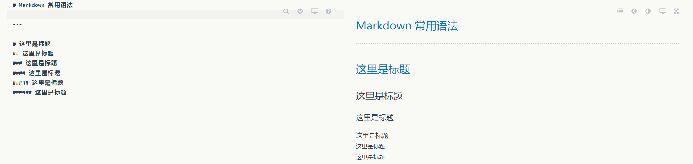
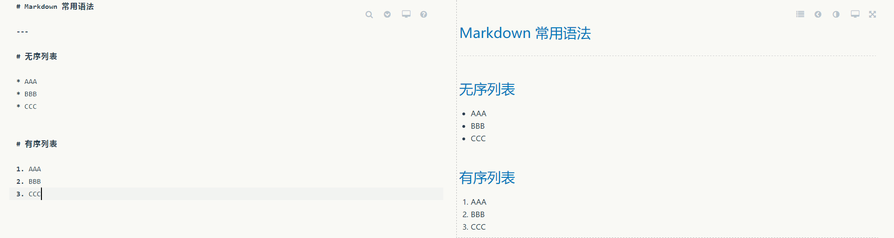
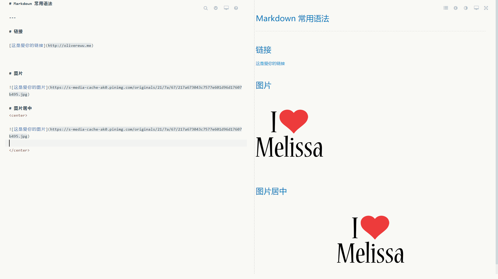
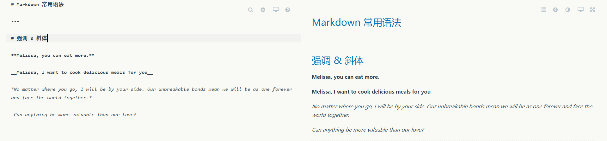
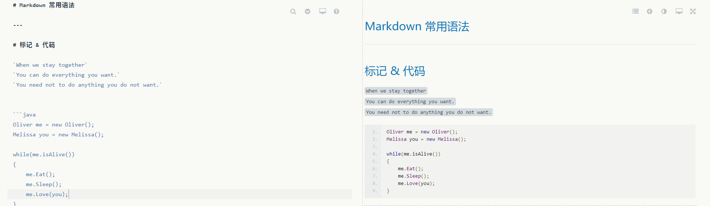
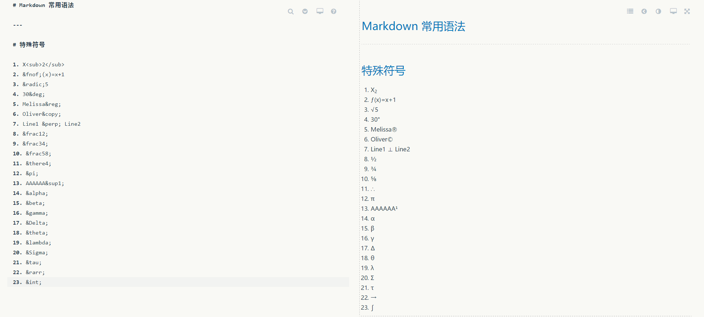
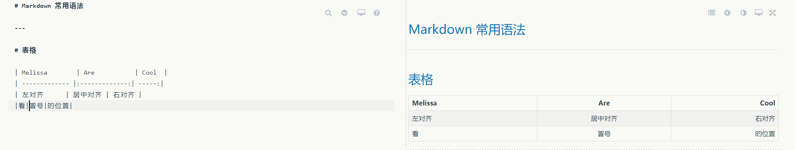
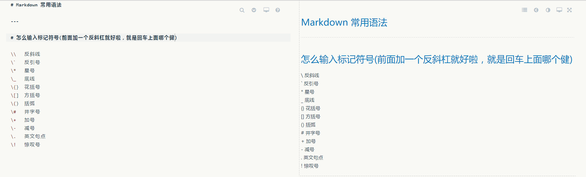

<!-- TOC depthFrom:1 depthTo:6 withLinks:1 updateOnSave:1 orderedList:0 -->

- [Quick Markdown Memo](#quick-markdown-memo)
	- [Paragraph](#paragraph)
	- [List](#list)
	- [Link & Images](#link-images)
	- [Blockquotes](#blockquotes)
	- [Underline & Italics](#underline-italics)
	- [Mark & Code](#mark-code)
	- [Symbols](#symbols)
	- [Form](#form)
	- [Special Usage](#special-usage)

<!-- /TOC -->

# Quick Markdown Memo

## Paragraph




## List

```Markdown

* AAA
  * DDD (前面每多空两格，就会显示成下一层级的列表符号)
  * EEE
* BBB
* CCC

1. AAA
2. BBB
3. CCC
```




## Link & Images

```Markdown
[link](http://oliverwu.me)


```




## Blockquotes

```Markdown
> AAAAA
> bbbbb

> AAAAA
BBBBB

>> CCCCC

>>> DDDDD

```


## Underline & Italics

```Markdown
**加粗**
__加粗__
*斜体*
_斜体_
~~删除线~~
```




## Mark & Code

```Markdown
`标记`
```




## Symbols




## Form

```Markdown
|AAA|BBB|
|---|---|
|ccc|ddd|
```




## Special Usage


