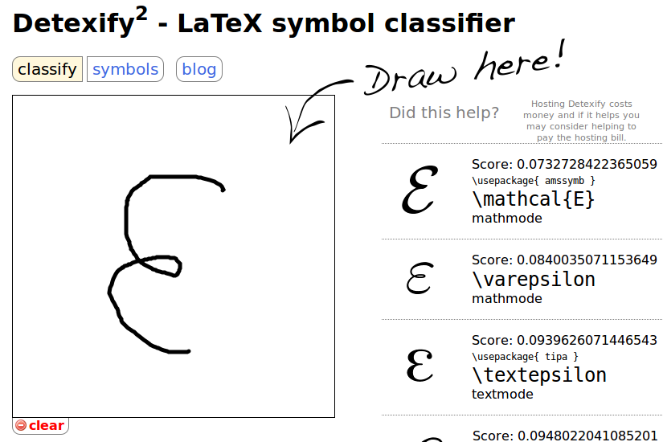

<!-- TOC depthFrom:1 depthTo:6 withLinks:1 updateOnSave:1 orderedList:0 -->

- [MathJax Quick Memo](#mathjax-quick-memo)
	- [Basis](#basis)
		- [Formula Mark](#formula-mark)
		- [Greek Letter](#greek-letter)
		- [Superscript & Subscript](#superscript-subscript)
		- [Brackets](#brackets)
		- [Summation & Integration](#summation-integration)
		- [Fraction & Radical Expression](#fraction-radical-expression)
		- [Font Family](#font-family)
		- [Special Functions & Symbols](#special-functions-symbols)
		- [Space](#space)
		- [Symbols over letters](#symbols-over-letters)
	- [Form](#form)
	- [Matrix](#matrix)
		- [Basis Usage](#basis-usage)
		- [Matrix Brackets](#matrix-brackets)
		- [Ellipsis](#ellipsis)
		- [Augmented Matrix](#augmented-matrix)
	- [Aligned Formula](#aligned-formula)
	- [Piecewise Expression](#piecewise-expression)
	- [Space Problem](#space-problem)
		- [Using of \\frac](#using-of-frac)
		- [Separator](#separator)
		- [Multiple Integration](#multiple-integration)
	- [Continued Fraction](#continued-fraction)
	- [Equation Set](#equation-set)
	- [Color](#color)
	- [Formula Mark & Quote](#formula-mark-quote)
	- [HTML Color Quick Reference](#html-color-quick-reference)
	- [Mathematics Symbols Quick Reference](#mathematics-symbols-quick-reference)

<!-- /TOC -->

# MathJax Quick Memo

## Basis
---

### Formula Mark

使用`MathJax`时，需要用一些适当的标记告诉`MathJax`某段文本是公式代码。此外，`MathJax`中的公式排版有两种方式，`inline`和`displayed`。`inline`表示公式嵌入到文本段中，`displayed`表示公式独自成为一个段落（也就是居中显示）。例如 $f(x) = 3 * x$ 这是一个`inline`公式，而下面：
$$f(x) = 3 * x$$
这就是一个`displayed`公式。

在`MathJax`中，默认的`displayed`公式分隔符有`$$...$$`和`\[...\]`，而默认的`inline`公式分隔符是`$...$`。

### Greek Letter

具体见下表：

|名称|大写|Tex|小写|Tex|
|-----|-----|-----|-----|-----|
|alpha|||$\alpha$|\alpha|
|beta|||$\beta$|\beta|
|gamma|$\Gamma$|\Gamma|$\gamma$|\gamma|
|delta|$\Delta$|\Delta|$\delta$|\delta|
|epsilon|||$\epsilon$|\epsilon|
|zeta|||$\zeta$|\zeta|
|eta|||$\eta$|\eta|
|theta|$\Theta$|\theta|$\Theta$|\theta|
|iota|||$\iota$|\iota|
|kappa|||$\kappa$|\kappa|
|lambda|$\Lambda$|\Lambda|$\lambda$|\lambda|
|mu|||$\mu$|\mu|
|nu|||$\nu$|\nu|
|xi|$\Xi$|\Xi|$\xi$|\xi|
|omicron|||$\omicron$|\omicron|
|pi|$\Pi$|\Pi|$\pi$|\pi|
|rho|||$\rho$|\rho|
|sigma|$\Sigma$|\Sigma|$\sigma$|\sigma|
|tau|||$\tau$|\tau|
|upsilon|$\Upsilon$|\Upsilon|$\upsilon$|\upsilon|
|phi|$\Phi$|\Phi|$\phi$|\phi|
|chi|||$\chi$|\chi|
|psi|$\Psi$|\Psi|$\psi$|\psi|
|omega|$\Omega$|\Omega|$\omega$|\omega|

### Superscript & Subscript

上标和下标分别用`^`和`_`，如`x_i^2`:$x_i^2$，但是`^`和`_`分别只对下一个数起作用，比如`10^10`会得到$10^10$而不是$10^{10}$，这事需要用`{...}`把要组合的数组合起来，也就是`10^{10}`。总之，加了大括号总归不会错。

### Brackets

* 小括号和方括号，就用原始的`()`和`[]`:$(2+2)$ $[3+3]$;
* 大括号，由于大括号用来`分组`,所以如果要在公式里面加大括号就使用`\{`和`\}`或者用`\lbrace`和`\rbrace`来表示。如`\{a*b\}`:$\{a*b\}$,`\lbrace a*b \rbrace`:$\lbrace a*b \rbrace$;
* 尖括号，使用`\langle`和`\rangle`表示左右尖括号，`\langle x \rangle`: $\langle x \rangle$;
* 上取整，使用`\lceil`和`\rceil`表示左右尖括号，`\lceil x \rceil`: $\lceil x \rceil$;
* 下取整，使用`\lfloor`和`\rfloor`表示左右尖括号，`\lfloor x \rfloor`: $\lfloor x \rfloor$;
* 不可见括号，使用`\left.`和`\right.`表示，`\left. x\right.`:$\left. x\right.$

需要注意的是，原始的符号不会随着公式的变大而缩放，比如`\frac{1}{2}`:$\frac{1}{2}$。可以使用`\left( ... \right)`进行缩放，如下：

<p align="center">
<code>
\{ \sum_{i=0}^{n}i^2 = \frac {(n^2+n)(2n+1)}{6} \}
</code>
</p>

$$\{ \sum_{i=0}^{n}i^2 = \frac {(n^2+n)(2n+1)}{6} \}$$     

<p align="center">
<code>
\left\{ \sum_{i=0}^{n}i^2 = \frac {(n^2+n)(2n+1)}{6} \right\}
</code>
</p>

$$\left\{ \sum_{i=0}^{n}i^2 = \frac {(n^2+n)(2n+1)}{6} \right\}$$

### Summation & Integration

* `\sum`用来表示求和符号，上标表示上限，下标表示下限。如，`\sum_{i=1}^{n}i^2`:$\sum_{i=1}^{n}i^2$;
* `\int`用来表示积分符号，上标表示上限，下标表示下限。如，`\int_{1}^{\infty}i^2`:$\int_{1}^{\infty}i^2$;
* 类似的符号还有，`\prod`:$\prod$, `\igcup`:$\bigcup$, `\bigcap`:$\bigcap$, `\iint`:$\iint$

### Fraction & Radical Expression

* 分式，第一种表示为`\frac{a}{b}`:$\frac{a}{b}$。第二种表示为`{a+1 \over b+1}`:${a+1 \over b+1}$;
* 根式，表示为`\sqrt`,比如`\sqrt[4]{\frac {x}{y}}`:$\sqrt[4]{\frac {x}{y}}$

### Font Family

* 黑板粗体字，例如 `\mathbb`或者`\Bbb`，这种字体常用来表示实数、整数、有理数、复数的大写字母，`\mathbb A`:$\mathbb A$,或者`\mathbb {ABCDEFGHIJKLMNOPQRSTUVWXYZ}`:$\mathbb {ABCDEFGHIJKLMNOPQRSTUVWXYZ}$;
* 黑体字，例如 `mathbf`, `\mathbf A`:$\mathbf A$,或者`\mathbf {ABCDEFGHIJKLMNOPQRSTUVWXYZ}`:$\mathbf {ABCDEFGHIJKLMNOPQRSTUVWXYZ}$;
* 打印机字体，例如 `mathtt`, `\mathtt A`:$\mathtt A$,或者`\mathtt {ABCDEFGHIJKLMNOPQRSTUVWXYZ}`:$\mathtt {ABCDEFGHIJKLMNOPQRSTUVWXYZ}$;
* 罗马字体，例如 `mathrm`, `\mathrm A`:$\mathrm A$,或者`\mathrm {ABCDEFGHIJKLMNOPQRSTUVWXYZ}`:$\mathrm {ABCDEFGHIJKLMNOPQRSTUVWXYZ}$;
* 手写字体，例如 `mathscr`, `\mathscr A`:$\mathscr A$,或者`\mathscr {ABCDEFGHIJKLMNOPQRSTUVWXYZ}`:$\mathscr {ABCDEFGHIJKLMNOPQRSTUVWXYZ}$;
* `Fraktur`一种德国字体，例如 `mathfrak`, `\mathfrak A`:$\mathfrak A$,或者`\mathfrak {ABCDEFGHIJKLMNOPQRSTUVWXYZ}`:$\mathfrak {ABCDEFGHIJKLMNOPQRSTUVWXYZ}$;

### Special Functions & Symbols

* 常见的三角函数、求极限符号可以直接使用缩写即可，如 `\sin (x)`:$\sin (x)$, `\arctan (x)`:$\arctan (x)$, `\lim_{1\rightarrow\infty}x`:$\lim_{1\rightarrow\infty}x$;
* 比较运算符，`\lt`:$\lt$, `\gt`:$\gt$, `\le`:$\le$, `\ge`:$\ge$, `\neq`:$\neq$,同时如果在前面加上`\not`就可以是 `\not\lt`:$\not\lt$;
* 运算符， `\times`:$\times$,`\div`:$\div$,`\pm`:$\pm$,`\mp`:$\mp$,`x \cdot y`:$x \cdot y$;
* 集合关系运算，`\cup`: $\cup$,`\cap`: $\cap$,`\setminus`: $\setminus$,`\subset`: $\subset$,`\subseteq`: $\subseteq$,`\subsetneq`: $\subsetneq$,`\supset`: $\supset$,`\in`: $\in$,`\notin `: $\notin$,`\emptyset`: $\emptyset$,`\varnothing`: $\varnothing$;
* 表示排列使用`{n+1 \choose 2k}`或者`\binom{n+1}{2k}`表示 $\binom{n+1}{2k}$;
* 箭头，`\to`:$\to$,`\rightarrow`:$\rightarrow$,`\Rightarrow`:$\Rightarrow$,`\leftarrow`:$\leftarrow$,`\Leftarrow`:$\Leftarrow$,`\mapsto`:$\mapsto$,
* 逻辑运算符， `\land`:$\land$,`\lor`:$\lor$,`\lnot`:$\lnot$,`\forall`:$\forall$,`\exists`:$\exists$,`\top`:$\top$,`\bot`:$\bot$,`\vdash`:$\vdash$,`\vDash`:$\vDash$;
* 特殊运算符， `\star`:$\star$,`\ast`:$\ast$,`\oplus`:$\oplus$,`\circ`:$\circ$,`\bullet`:$\bullet$;
* 等于运算符， `\approx`:$\approx$,`\sim`:$\sim$,`\cong`:$\cong$,`\equiv`:$\equiv$,`\prec`:$\prec$;
* 特殊符号， `\infty`:$\infty$,`\aleph_0`:$\aleph_0$,`\nabla`:$\nabla$,`\partial`:$\partial$,`\Im`:$\Im$,`\Re`:$\Re$;
* 膜运算符， `a \pmod b`:$a \pmod b$， 例如 `a\equiv b\pmod n`:$a\equiv b\pmod n$;
* 省略符， `\ldots`:$\ldots$ 与 `\cdots`:$\cdots$，就是位置不一样的3个点;
* 一些希腊字母的变体形式， 例如 `\epsilon`:$\epsilon$,`\varepsilon`:$\varepsilon$,`\phi`:$\phi$,`\varphi`:$\varphi$。

### Space

由于`MathJax`的空间管理比较特殊，所以 `a.b`或者 `a.........b`（...表示空格），都会显示为 `a b`:$a b$,如果要增加间隙，可以使用 `a\,b`:$a\,b$，较宽的间隙 `a\;b`:$a\;b$，或者是使用 `a\quad b`:$a\quad b$ 或 `a\qquad b`:$a\qquad b$。还有一种比较方便的方法是不使用转义字符`\`而是这样 `a~b`:$a~b$，可以表示一个空格。

### Symbols over letters

对于单字符， `\hat x`:$\hat x$，对于多个字符使用 `\widehat {xy}`:$\widehat {xy}$，类似的还有 `\overline {xy}`:$\overline {xy}$,`\vec {xy}`:$\vec {xy}$,`\overrightarrow {xy}`:$\overrightarrow {xy}$,`\dot  {xy}`:$\dot  {xy}$,`\ddot  {xy}`:$\ddot  {xy}$,

## Form
---

可以使用 `$$\begin{array}{列样式}…\end{array}$$`的方式来创建表格，其中`列样式`可以`clr`分别表示`居中` `左` `右`，还可以用`|`表示一条竖线。表格中每一行用`\\`分隔，每一列使用 `&`分隔，使用 `\hline`在本行前面加一条直线，例如：

```Markdown
$$
\begin{array}{c|lcr}
n & \text{Left} & \text{Center} & \text{Right} \\
\hline
1 & 0.24 & 1 & 125 \\
2 & -1 & 189 & -8 \\
3 & -20 & 2000 & 1+10i \\
\end{array}
$$
```

$$
\begin{array}{c|lcr}
n & \text{Left} & \text{Center} & \text{Right} \\
\hline
1 & 0.24 & 1 & 125 \\
2 & -1 & 189 & -8 \\
3 & -20 & 2000 & 1+10i \\
\end{array}
$$

一个可以复用的例子如下：

```Markdown
$$
\begin{array}{c|ccc}
n & \text{0} & \text{1} & \text{2} & \text{3}\\
\hline
1 & 1 & 2 & 3 & 4 \\
2 & 2 & 3 & 4 & 5 \\
3 & 3 & 4 & 5 & 6 \\
4 & 4 & 5 & 6 & 7 \\
\end{array}
$$
```

$$
\begin{array}{c|ccc}
n & \text{0} & \text{1} & \text{2} & \text{3}\\
\hline
1 & 1 & 2 & 3 & 4 \\
2 & 2 & 3 & 4 & 5 \\
3 & 3 & 4 & 5 & 6 \\
4 & 4 & 5 & 6 & 7 \\
\end{array}
$$

## Matrix
---

### Basis Usage

使用`$$\begin{matrix}…\end{matrix}$$`来表示矩阵，同样使用 `\\`作为行分隔符，`&`使用列分隔符。

例如：

```Markdown
$$
        \begin{matrix}
        1 & x & x^2 \\
        1 & y & y^2 \\
        1 & z & z^2 \\
        \end{matrix}
$$
```

$$
        \begin{matrix}
        1 & x & x^2 \\
        1 & y & y^2 \\
        1 & z & z^2 \\
        \end{matrix}
$$

### Matrix Brackets

如果要加括号，可以使用`\left`和`\right`，也可以使用特殊的`Matrix`，例如:
* 单独加括号
```Markdown
$$
\left ( \begin{matrix}
1 & x & x^2 \\
1 & y & y^2 \\
1 & z & z^2 \\
\end{matrix}\right )
$$
```

$$
        \left ( \begin{matrix}
        1 & x & x^2 \\
        1 & y & y^2 \\
        1 & z & z^2 \\
        \end{matrix}\right )
$$

* 使用`pmatrix`

```Markdown
$$
        \begin{pmatrix}
        1 & x & x^2 \\
        1 & y & y^2 \\
        1 & z & z^2 \\
        \end{pmatrix}
$$
```

$$
        \begin{pmatrix}
        1 & x & x^2 \\
        1 & y & y^2 \\
        1 & z & z^2 \\
        \end{pmatrix}
$$

* 使用`bmatrix`

```Markdown
$$
        \begin{bmatrix}
        1 & x & x^2 \\
        1 & y & y^2 \\
        1 & z & z^2 \\
        \end{bmatrix}
$$
```

$$
        \begin{bmatrix}
        1 & x & x^2 \\
        1 & y & y^2 \\
        1 & z & z^2 \\
        \end{bmatrix}
$$

* 使用`Bmatrix`

```Markdown
$$
        \begin{Bmatrix}
        1 & x & x^2 \\
        1 & y & y^2 \\
        1 & z & z^2 \\
        \end{Bmatrix}
$$
```

$$
        \begin{Bmatrix}
        1 & x & x^2 \\
        1 & y & y^2 \\
        1 & z & z^2 \\
        \end{Bmatrix}
$$

* 使用`vmatrix`

```Markdown
$$
        \begin{vmatrix}
        1 & x & x^2 \\
        1 & y & y^2 \\
        1 & z & z^2 \\
        \end{vmatrix}
$$
```

$$
        \begin{vmatrix}
        1 & x & x^2 \\
        1 & y & y^2 \\
        1 & z & z^2 \\
        \end{vmatrix}
$$

* 使用`Vmatrix`

```Markdown
$$
        \begin{Vmatrix}
        1 & x & x^2 \\
        1 & y & y^2 \\
        1 & z & z^2 \\
        \end{Vmatrix}
$$
```

$$
        \begin{Vmatrix}
        1 & x & x^2 \\
        1 & y & y^2 \\
        1 & z & z^2 \\
        \end{Vmatrix}
$$

### Ellipsis

可以使用`\cdots`  `\ddots`  `\vdots` 来省略矩阵中的元素，例如：

```Markdown
$$
\begin{pmatrix}
1 & x & x^2 & \cdots & x^n\\
1 & y & y^2 & \cdots & y^n\\
1 & z & z^2 & \cdots & z^n\\
\vdots & \vdots & \vdots & \ddots & \vdots\\
1 & n & n^2 & \cdots & n^n\\
\end{pmatrix}
$$
```

$$
        \begin{pmatrix}
        1 & x & x^2 & \cdots & x^n\\
        1 & y & y^2 & \cdots & y^n\\
        1 & z & z^2 & \cdots & z^n\\
        \vdots & \vdots & \vdots & \ddots & \vdots\\
        1 & n & n^2 & \cdots & n^n\\
        \end{pmatrix}
$$


### Augmented Matrix

增广矩阵需要使用前面的`array`来实现，例如：

```Markdown
$$ \left[
      \begin{array}{cc|c}
        1&2&3\\
        4&5&6
      \end{array}
    \right]
$$
```

$$ \left[
      \begin{array}{cc|c}
        1&2&3\\
        4&5&6
      \end{array}
    \right]
$$

## Aligned Formula
---

如果需要一系列的公式中等号对齐，可以使用`\begin{align}…\end{align}`，其中使用 `&` 来对其位置，例如：

```Markdown
$$
\begin{align}
\sqrt{37} & = \sqrt{\frac{73^2-1}{12^2}} \\
 & = \sqrt{\frac{73^2}{12^2}\cdot\frac{73^2-1}{73^2}} \\
 & = \sqrt{\frac{73^2}{12^2}}\sqrt{\frac{73^2-1}{73^2}} \\
 & = \frac{73}{12}\sqrt{1 - \frac{1}{73^2}} \\
 & \approx \frac{73}{12}\left(1 - \frac{1}{2\cdot73^2}\right)
\end{align}
$$
```

$$
\begin{align}
\sqrt{37} & = \sqrt{\frac{73^2-1}{12^2}} \\
 & = \sqrt{\frac{73^2}{12^2}\cdot\frac{73^2-1}{73^2}} \\
 & = \sqrt{\frac{73^2}{12^2}}\sqrt{\frac{73^2-1}{73^2}} \\
 & = \frac{73}{12}\sqrt{1 - \frac{1}{73^2}} \\
 & \approx \frac{73}{12}\left(1 - \frac{1}{2\cdot73^2}\right)
\end{align}
$$

## Piecewise Expression
---

分类表达式可以使用 `\begin{cases}…\end{cases}` 其中用`&`指示对齐的位置，例如：

```Markdown
$$
f(n) =
\begin{cases}
n/2,  & \text{if $n$ is even} \\
3n+1, & \text{if $n$ is odd}  \\
\end{cases}
$$
```

$$
f(n) =
\begin{cases}
n/2,  & \text{if $n$ is even} \\
3n+1, & \text{if $n$ is odd}  \\
\end{cases}
$$

上述公式的括号也可以移动到右侧，不过需要使用`array`来实现，如下：

```Markdown
$$
\left.
\begin{array}{l}
\text{if $n$ is even:}&n/2\\
\text{if $n$ is odd:}&3n+1
\end{array}
\right\}
=f(n)
$$
```

$$
\left.
\begin{array}{l}
\text{if $n$ is even:}&n/2\\
\text{if $n$ is odd:}&3n+1
\end{array}
\right\}
=f(n)
$$

最后，如果想分类之间的垂直间隔变大，可以使用`\[2ex]`代替`\`来分隔不同的情况。(`3ex`,`4ex`也可以用，`1ex`相当于原始距离）。

  ```Markdown
  $$
  f(n) =
  \begin{cases}
  n/2,  & \text{if $n$ is even} \\[4ex]
  3n+1, & \text{if $n$ is odd}  \\
  \end{cases}
  $$
  ```

  $$
  f(n) =
  \begin{cases}
  n/2,  & \text{if $n$ is even} \\[4ex]
  3n+1, & \text{if $n$ is odd}  \\
  \end{cases}
  $$

## Space Problem
---

### Using of \\frac

不要在再指数或者积分中使用 `\frac`，在指数或者积分表达式中使用 `\frac`会使表达式看起来不清晰，因此在专业的数学排版中很少被使用。应该使用一个水平的`/`来代替，效果如下：

```Markdown
$$
\begin{array}{cc}
\mathrm{Bad} & \mathrm{Better} \\
\hline \\
e^{i\frac{\pi}2} \quad e^{\frac{i\pi}2}& e^{i\pi/2} \\
\int_{-\frac\pi2}^\frac\pi2 \sin x\,dx & \int_{-\pi/2}^{\pi/2}\sin x\,dx \\
\end{array}
$$
```

$$
\begin{array}{cc}
\mathrm{Bad} & \mathrm{Better} \\
\hline \\
e^{i\frac{\pi}2} \quad e^{\frac{i\pi}2}& e^{i\pi/2} \\
\int_{-\frac\pi2}^\frac\pi2 \sin x\,dx & \int_{-\pi/2}^{\pi/2}\sin x\,dx \\
\end{array}
$$

### Separator

使用 `\mid` 代替 `|` 作为分隔符，符号 `|` 作为分隔符时有排版空间大小的问题，应该使用`\mid`代替。效果如下：

```Markdown
$$
\begin{array}{cc}
\mathrm{Bad} & \mathrm{Better} \\
\hline \\
\{x|x^2\in\Bbb Z\} & \{x\mid x^2\in\Bbb Z\} \\
\end{array}
$$
```

$$
\begin{array}{cc}
\mathrm{Bad} & \mathrm{Better} \\
\hline \\
\{x|x^2\in\Bbb Z\} & \{x\mid x^2\in\Bbb Z\} \\
\end{array}
$$

### Multiple Integration

对于多重积分，不要使用`\int\int`此类的表达，应该使用`\iint` `\iiint`等特殊形式。效果如下：

```Markdown
$$
\begin{array}{cc}
\mathrm{Bad} & \mathrm{Better} \\
\hline \\
\int\int_S f(x)\,dy\,dx & \iint_S f(x)\,dy\,dx \\
\int\int\int_V f(x)\,dz\,dy\,dx & \iiint_V f(x)\,dz\,dy\,dx
\end{array}
$$
```

$$
\begin{array}{cc}
\mathrm{Bad} & \mathrm{Better} \\
\hline \\
\int\int_S f(x)\,dy\,dx & \iint_S f(x)\,dy\,dx \\
\int\int\int_V f(x)\,dz\,dy\,dx & \iiint_V f(x)\,dz\,dy\,dx
\end{array}
$$

## Continued Fraction
---

书写连分数表达式时，请使用`\cfrac`代替`\frac`或者`\over`两者效果对比如下:

```Markdown
$$
x = a_0 + \cfrac{1^2}{a_1
          + \cfrac{2^2}{a_2
          + \cfrac{3^2}{a_3 + \cfrac{4^4}{a_4 + \cdots}}}} \tag{\cfrac}
$$
```

$$
x = a_0 + \cfrac{1^2}{a_1
          + \cfrac{2^2}{a_2
          + \cfrac{3^2}{a_3 + \cfrac{4^4}{a_4 + \cdots}}}} \tag{\cfrac}
$$

```Markdown
$$
x = a_0 + \frac{1^2}{a_1
          + \frac{2^2}{a_2
          + \frac{3^2}{a_3 + \frac{4^4}{a_4 + \cdots}}}} \tag{\frac}
$$
```

$$
x = a_0 + \frac{1^2}{a_1
          + \frac{2^2}{a_2
          + \frac{3^2}{a_3 + \frac{4^4}{a_4 + \cdots}}}} \tag{\frac}
$$

## Equation Set
---

对于方程组可以使用`\begin{array} … \end{array}`与`\left{…\right.`配合，表示方程组：

```Markdown
$$
    \left\{
        \begin{array}{c}
            a_1x+b_1y+c_1z=d_1 \\
            a_2x+b_2y+c_2z=d_2 \\
            a_3x+b_3y+c_3z=d_3
        \end{array}
    \right.
$$
```

$$
    \left\{
        \begin{array}{c}
            a_1x+b_1y+c_1z=d_1 \\
            a_2x+b_2y+c_2z=d_2 \\
            a_3x+b_3y+c_3z=d_3
        \end{array}
    \right.
$$

同时，还可以使用`\begin{cases}…\end{cases}`表达同样的方程组，如：

```Markdown
$$
    \begin{cases}
        a_1x+b_1y+c_1z=d_1 \\
        a_2x+b_2y+c_2z=d_2 \\
        a_3x+b_3y+c_3z=d_3
    \end{cases}
$$
```

$$
    \begin{cases}
        a_1x+b_1y+c_1z=d_1 \\
        a_2x+b_2y+c_2z=d_2 \\
        a_3x+b_3y+c_3z=d_3
    \end{cases}
$$

对齐方程组中的 `=` 号，可以使用 `\being{aligned} .. \end{aligned}`，如：

```Markdown
$$
    \left\{
        \begin{aligned}
            a_1x+b_1y+c_1z &=d_1+e_1 \\
            a_2x+b_2y&=d_2 \\
            a_3x+b_3y+c_3z &=d_3
        \end{aligned}
    \right.
$$
```

$$
    \left\{
        \begin{aligned}
            a_1x+b_1y+c_1z &=d_1+e_1 \\
            a_2x+b_2y&=d_2 \\
            a_3x+b_3y+c_3z &=d_3
        \end{aligned}
    \right.
$$

如果要对齐 = 号 和项，可以使用\being{array}{列样式} .. \end{array}，如：

```Markdown
$$
    \left\{
        \begin{array}{ll}
            a_1x+b_1y+c_1z &=d_1+e_1 \\
            a_2x+b_2y &=d_2 \\
            a_3x+b_3y+c_3z &=d_3
        \end{array}
    \right.
$$
```

$$
    \left\{
        \begin{array}{ll}
            a_1x+b_1y+c_1z &=d_1+e_1 \\
            a_2x+b_2y &=d_2 \\
            a_3x+b_3y+c_3z &=d_3
        \end{array}
    \right.
$$


## Color
---

命名颜色是浏览器相关的，如果浏览器没有定义相关的颜色名称，则相关文本将被渲染为黑色，具体列表如下：

```Markdown
$$
    \begin{array}{|rc|}
        \hline
            \verb+\color{black}{text}+ & \color{black}{text} \\
            \verb+\color{gray}{text}+ & \color{gray}{text} \\
            \verb+\color{silver}{text}+ & \color{silver}{text} \\
            \verb+\color{white}{text}+ & \color{white}{text} \\
        \hline
            \verb+\color{maroon}{text}+ & \color{maroon}{text} \\
            \verb+\color{red}{text}+ & \color{red}{text} \\
            \verb+\color{yellow}{text}+ & \color{yellow}{text} \\
            \verb+\color{lime}{text}+ & \color{lime}{text} \\
            \verb+\color{olive}{text}+ & \color{olive}{text} \\
            \verb+\color{green}{text}+ & \color{green}{text} \\
            \verb+\color{teal}{text}+ & \color{teal}{text} \\
            \verb+\color{aqua}{text}+ & \color{aqua}{text} \\
            \verb+\color{blue}{text}+ & \color{blue}{text} \\
            \verb+\color{navy}{text}+ & \color{navy}{text} \\
            \verb+\color{purple}{text}+ & \color{purple}{text} \\
            \verb+\color{fuchsia}{text}+ & \color{magenta}{text} \\
        \hline
    \end{array}
$$
```

$$
    \begin{array}{|rc|}
        \hline
            \verb+\color{black}{text}+ & \color{black}{text} \\
            \verb+\color{gray}{text}+ & \color{gray}{text} \\
            \verb+\color{silver}{text}+ & \color{silver}{text} \\
            \verb+\color{white}{text}+ & \color{white}{text} \\
        \hline
            \verb+\color{maroon}{text}+ & \color{maroon}{text} \\
            \verb+\color{red}{text}+ & \color{red}{text} \\
            \verb+\color{yellow}{text}+ & \color{yellow}{text} \\
            \verb+\color{lime}{text}+ & \color{lime}{text} \\
            \verb+\color{olive}{text}+ & \color{olive}{text} \\
            \verb+\color{green}{text}+ & \color{green}{text} \\
            \verb+\color{teal}{text}+ & \color{teal}{text} \\
            \verb+\color{aqua}{text}+ & \color{aqua}{text} \\
            \verb+\color{blue}{text}+ & \color{blue}{text} \\
            \verb+\color{navy}{text}+ & \color{navy}{text} \\
            \verb+\color{purple}{text}+ & \color{purple}{text} \\
            \verb+\color{fuchsia}{text}+ & \color{magenta}{text} \\
        \hline
    \end{array}
$$

此外，`HTML5`与`CSS3`也定义了一些颜色名称。 同时，颜色也可以使用`#rgb`的形式来表示，`r`、`g`、`b`分别表示代表颜色值得16进制数，如:

```Markdown
$$
    \begin{array}{|rrrrrrrr|}\hline
        \verb+#000+ & \color{#000}{text} & & &
        \verb+#00F+ & \color{#00F}{text} & & \\
        & & \verb+#0F0+ & \color{#0F0}{text} &
        & & \verb+#0FF+ & \color{#0FF}{text}\\
        \verb+#F00+ & \color{#F00}{text} & & &
        \verb+#F0F+ & \color{#F0F}{text} & & \\
        & & \verb+#FF0+ & \color{#FF0}{text} &
        & & \verb+#FFF+ & \color{#FFF}{text}\\
        \hline
    \end{array}
$$
```

$$
    \begin{array}{|rrrrrrrr|}\hline
        \verb+#000+ & \color{#000}{text} & & &
        \verb+#00F+ & \color{#00F}{text} & & \\
        & & \verb+#0F0+ & \color{#0F0}{text} &
        & & \verb+#0FF+ & \color{#0FF}{text}\\
        \verb+#F00+ & \color{#F00}{text} & & &
        \verb+#F0F+ & \color{#F0F}{text} & & \\
        & & \verb+#FF0+ & \color{#FF0}{text} &
        & & \verb+#FFF+ & \color{#FFF}{text}\\
        \hline
    \end{array}
$$

## Formula Mark & Quote
---

使用`\tag{yourtag}`来标记公式，如果想在之后引用该公式，则还需要加上`\label{yourlabel}`在`\tag`之后，如:

\[
a := x^2-y^3 \tag{1-1}\label{ 1-1}
\]

```Markdown
\[
a := x^2-y^3 \tag{1-1}\label{ 1-1}
\]
```

为了引用公式，可以使用`\eqref{rlabel}`，如：

$$
a+y^3 \stackrel{\eqref{1-1}}= x^2
$$

```Markdown
$$
a+y^3 \stackrel{\eqref{1-1}}= x^2
$$
```


## HTML Color Quick Reference
---

[HTML色彩代码提取](http://html-color-codes.info/chinese/)

[HTML Color Picker](http://www.w3schools.com/colors/colors_picker.asp)


## Mathematics Symbols Quick Reference
---

`Detexify`,一个数学符号查询手写识别系统，如图：



`Detexify` : [$Detexify^2$](http://detexify.kirelabs.org/classify.html)
