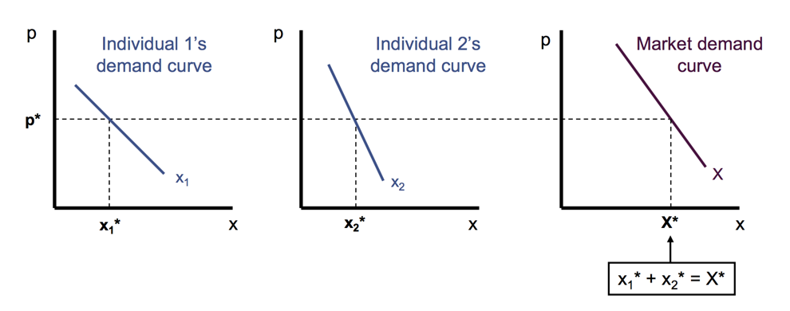
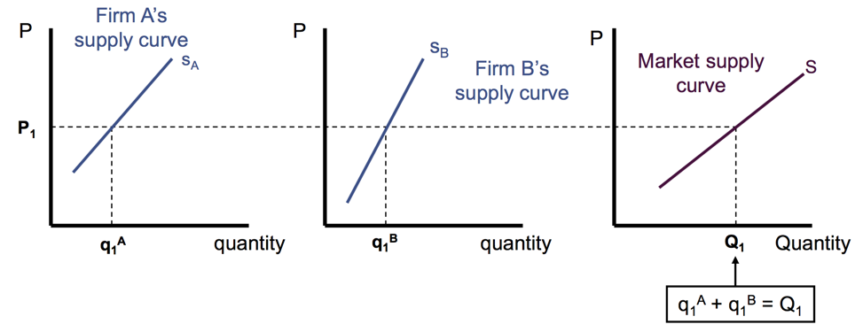
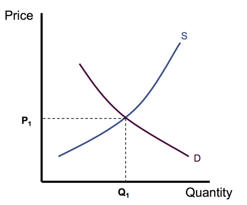
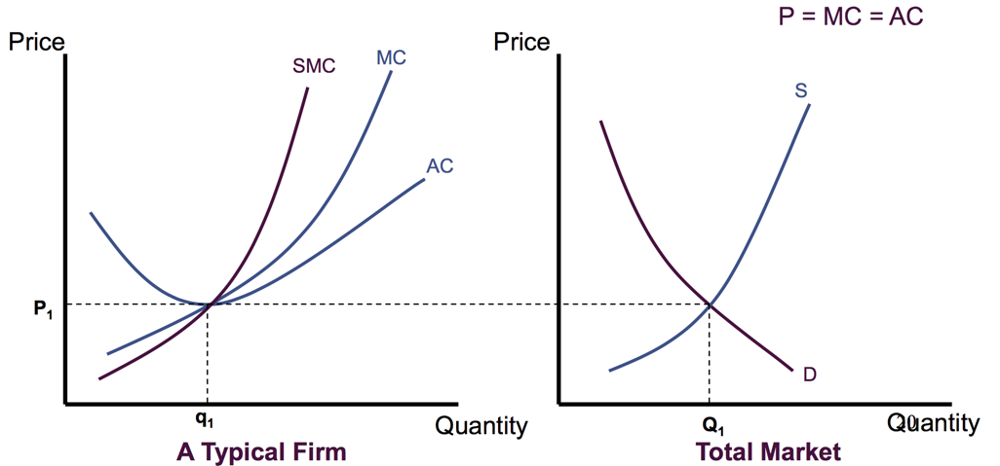

<!-- TOC depthFrom:1 depthTo:6 withLinks:1 updateOnSave:1 orderedList:0 -->

- [Chapter 11 Profit Maximization](#chapter-11-profit-maximization)
	- [Marginal revenue](#marginal-revenue)
	- [Uncompensated Factor Demand](#uncompensated-factor-demand)
		- [Short-Run supply by a price-taking firm:](#short-run-supply-by-a-price-taking-firm)
		- [Graph](#graph)
		- [Long Run supply by a price taking firm](#long-run-supply-by-a-price-taking-firm)
- [Chapter 12  Partial Equilibrium](#chapter-12-partial-equilibrium)
	- [Consumers' decisions](#consumers-decisions)
	- [Firms' decisions](#firms-decisions)
	- [Equilibrium price and quantity](#equilibrium-price-and-quantity)
		- [Short Run market reaction](#short-run-market-reaction)
		- [Long run (firms can enter and exit)](#long-run-firms-can-enter-and-exit)
			- [Perfect competitive market:](#perfect-competitive-market)

<!-- /TOC -->

# Chapter 11 Profit Maximization

choose an appropriate level of output.     

* Total revenue $R(q)=p(q)·q$, when $R$ depends on $q$     
  (lower the price to sell a larger amount of products)     

* total cost of producing $q$ is $C(q)$
profits     

* $\pi= R(q) - C(q)$     

1. Output choice $~max ~ R(q)-C(q)$, Take derivatives $\frac{d\pi}{dq}=0$     

2. Profits are max when $MR=\frac{dR}{dq} = \frac{dC}{dq} = MC$

3. Second derivatives: $\frac{d^2 \pi}{dq^2}<0$, concave, mountain shape at maximum.       

## Marginal revenue     

$MR(q) = \frac{dR(q)}{dq} = \frac{d[q~p(q)]}{dq} = p(q)+q\frac{dp}{dq}$     
      
      
      
      
      

**Example**:      
Demand function: $q=100-10p$

1. Solve for the Price $p=10 - \frac{q}{10}$     

2. Given total cost = $5q$     

3. Maximize profit Max $\pi (q)= p*q -TC = (10 - \frac{q}{10})q - 5q$     

4. f.o.c: $10-\frac{q}{5}-5=0$      

5. $q^* = 25, p^* =7.5, \pi = 62.5$

## Uncompensated Factor Demand
When price does not depend on the quantity.     

By maximizing profit,      
Max $\pi (q)= pq-$ total cost = Max $p*f(k,l)-(vk+wl)$

* take f.o.c to $0:$      
$p*f_l(k,l)-w=0, ~l^* = l(p,v,w)$     
$p*f_k(k,l)-v=0, ~ k^* = l(p,v,w)$

### Short-Run supply by a price-taking firm:    
(firm takes price as given)     
labor is easier to be changed than capital.     

Make decision:    
1. Positive quantity ($q>0$)     
MR=Short MC, p=Short MC     

2. Shut down production at $q^{* }$     
p<SAVC     
`price is not lager enough to cover...`     

**Example**:     

$\pi = pq-C(q)$      

$= q (p - \frac{C(q)}{q})$      

$= q(p-SAC_q)$     

$= q(p-(SAVC_q +SAFC_q))$       

$= q*(p-(SAVC_q) - q*SAFC_q$      

$= q(p-(SAVC_q) - q\frac{SFC_q}{q}$      

$= q(p-(SAVC_q) - SFC$

$\pi_s = -SFC$ | shut down production $q^* =0$     
--- | ---
$\pi_0 = q*(p-(SAVC_q) - SFC$ | quantity $q^* >0$

when choose to Shut down the production, meaning that     
$\pi_s = -SFC >  q*(p-(SAVC_q) - SFC = \pi_0$      

&rarr; $0>  q*(p-(SAVC_q))$  
&rarr; $p < SAVC_q$      

### Graph
      
      
      
      
      
      
      
      
      
       
      
      
      
      
       

profits = $pq-SC(q) = q(p-SAC)$      

If price rises to $q^{** }$     
If price falls to $q^{*** }$, $p=MC$, MC upper-forwarding slope     
If price falls to $q^{**** }$, shut down, p < $SAVC_q$      

### Long Run supply by a price taking firm     
Make decisions:     

1. produce positive $q$     
$MR=MC$, $p=MC$     

2. exit the market at $q^{* }$.     
$\pi < 0$ &rarr; $p< AC$     
`price is not high enough to cover the average costs.`       

# Chapter 12  Partial Equilibrium

## Consumers' decisions
market demand function

* Only two goods: $x,y$     
Marshallian demand for x is $~x^* (p, p_y, I)$     

* Market demand is the sum of all individuals marshallian demand.     
Market demand $Q_D (p, p_y, I) = \Sigma_{i=1} ^n x_i (p, p_y, I)$

Change in $p_x$ result in movement along the curve, quantity demanded.     

Change in $p_y$ or $I$, results demand curve for x shift.

## Firms' decisions
market supply function     

* Market supply is the sum of all individuals marshallian demand.     
Market demand $Q_S (p,v,w) = \Sigma_{i=1} ^n q_i (p,w,v)$

*  * Short run: market supply is the sum of the quantity supplied by existing Firms. (cannot enter ot exist the industry in the short run)     

   * Long run un market supply s the sum of the quantity supplied by existing and entering firms.    

     

## Equilibrium price and quantity     
* Equilibrium price, quantity demanded =  quantity supplied.     
 Every one is on their optimal options.     

* At $p^{* }, Q_S (p,v,w) = Q_D (p, p_y, I)$     

      
      
      

### Short Run market reaction
`Many buyers experience an increase in the demands, the market demand curve will shift to the right.`

Shift in Supply | Shift in Demand
-- | --
Equilibrium price falls and Equilibrium quantity rises.| Equilibrium price and quantity both rises.

### Long run (firms can enter and exit)

1. (Assume $\pi >0$, positive profit)    
  * new market will enter.    
    - short run, market supply curve shifts outward
    - price goes down, profit decreases.

2. (Assume $\pi < 0$, negative profit)    
  * existing firms will leave market,
    - short run: market supply curve shifts inward
    - price goes up, profit increase.     

#### Perfect competitive market:

(market is in long-run Equilibrium.)

* all firm maximize profit;
* no firm has intent to enter nor exit.

$p=MC=MR=AC$, operate at minimum $AC$     
ZERO profits $= q(p-AC)$      
(for different cost functions, marginal firms are make zero profits)

* LRE Constant cost case:     
  - entry of new firms has no effect on the cost of inputs;     
  - firms enter or leave an industry, the firm’s cost curves will remain unchanged.     

     
