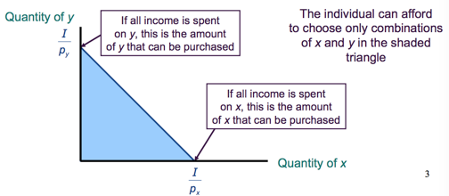
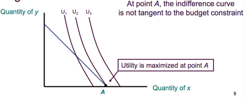
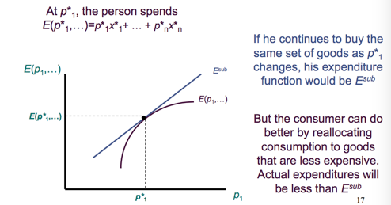
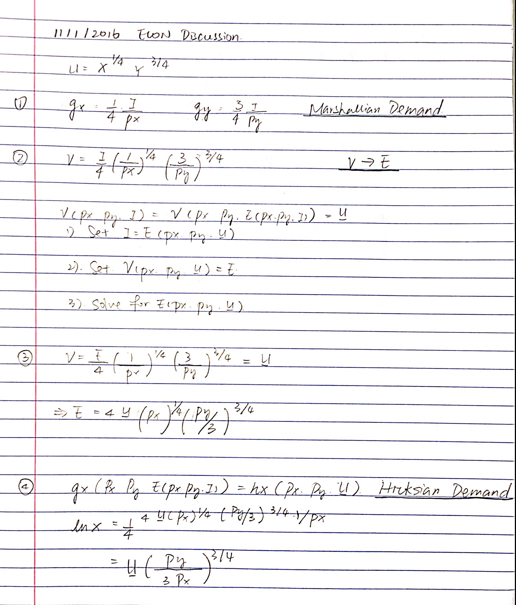
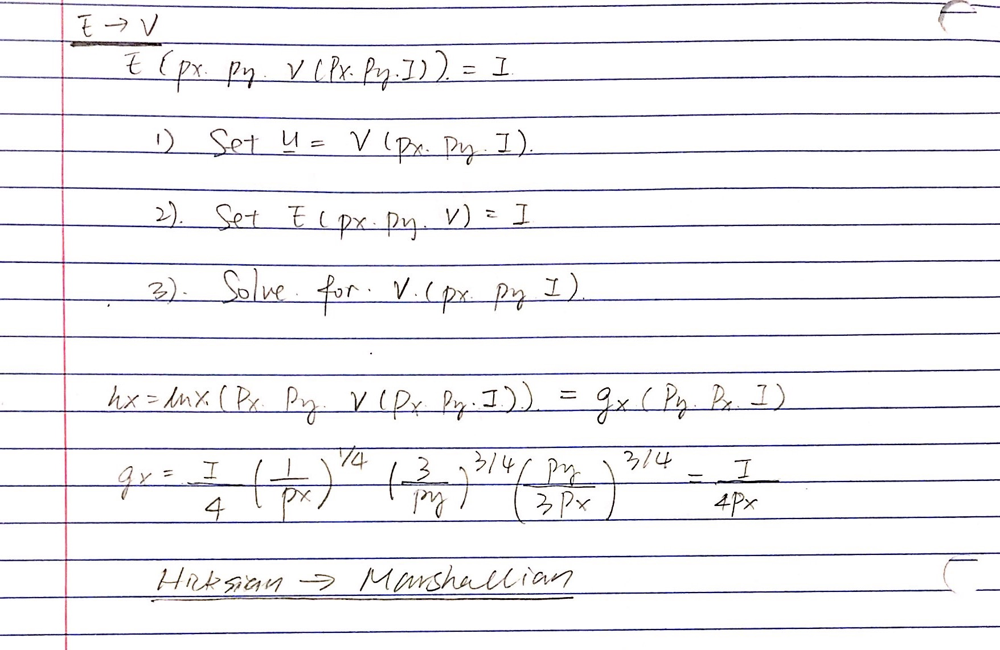

<!-- TOC depthFrom:1 depthTo:6 withLinks:1 updateOnSave:1 orderedList:0 -->

- [Chapter 3 Preference and Utility](#chapter-3-preference-and-utility)
	- [Rational Choices](#rational-choices)
	- [Utility:](#utility)
	- [Trade and Substitution:](#trade-and-substitution)
		- [indifference curves](#indifference-curves)
		- [Transitivity](#transitivity)
		- [Convexity](#convexity)
		- [Example of utility functions](#example-of-utility-functions)
		- [Homothetic Preference:](#homothetic-preference)
	- [The many good case:](#the-many-good-case)
- [Chapter 4, Utility Maximization and Choices](#chapter-4-utility-maximization-and-choices)
	- [The Budget Constraint:](#the-budget-constraint)
	- [First Order condition for a maximum.](#first-order-condition-for-a-maximum)
	- [Second Order condition for a maximum](#second-order-condition-for-a-maximum)
		- [Corner Solutions](#corner-solutions)
		- [Marshallian Demand Funciton](#marshallian-demand-funciton)
		- [Perfect Substitution Example:](#perfect-substitution-example)
		- [Perfect Complements Example:](#perfect-complements-example)
	- [Indirect Utility Function:](#indirect-utility-function)
	- [Expenditure Minimization](#expenditure-minimization)
		- [Properties of expenditure functions      $y=-\frac{p_x}{p_y}x+\frac{E}{p_y}$](#properties-of-expenditure-functions-y-fracpxpyxfracepy)
		- [Hicksian Demand Function](#hicksian-demand-function)
	- [Summary](#summary)
		- [Marshallian-Demand-Funciton &rarr; Hicksian-Demand-Function](#marshallian-demand-funciton-rarr-hicksian-demand-function)

<!-- /TOC -->

# Chapter 3 Preference and Utility
how people make decisions.    

## Rational Choices
* Completeness:      
  - ‘‘A is preferred to B,’’     
  - ‘‘B is preferred to A,’’      
  - ‘‘A and B are equally attractive.’’     
* Transitivity:      
  - ‘‘A is preferred to B,  B is preferred to C, so A is preferred to C’’     
* Continuity:     
  - If ‘‘A is preferred to B’’, then situations suitably ‘‘close to’’ A must also be preferred to B     
 

## Utility:     

* Axioms satisfied &rarr; utility function.      
* Utility ranks the desirability  of consumption, not the happiness , nor depend on people;     

Example:      

|A: 0.3 carat Dimond Ring  | B: 3 carat Dimond Ring|
|------------- | -------------|
|Let: $U(B) = 10,  U(A) = 5$ |      
|$U(B) = 20,  U(A) = 10$|  multiple by  2|
|$U(B) = 100,  U(A) = 2$| multiple by power of 2|
|$U(B) = 2.3,  U(A) = 1.6$| log|

&rarr; U(B) > U(A)$ for most people. (the desire of B)     

&rarr; Imply a increasing function.     

## Trade and Substitution:
* **Indifference Curve** shows a set of consumption bundles among which the individual is indifferent.
* **Marginal rate of substitution**, **MRS**, the negative of the slope of the indifference curve at any point. $MRS=-\frac{dy}{dx}$.     

  - measures individuals willingness to trade $y$ for $x$;     
  - MRS changes as $x$ and $y$ change.      

Example:
All $x$, $y$ such that $U(x, y) = K$;  

Total differential $U' = 0$;   

$d U = \frac {\partial L}{\partial x} +  \frac {\partial L}{\partial y} = 0$   
 

### indifference curves
### Transitivity     
no intersection.     

### Convexity     
* instead of consuming the extreme value, taking average of the two, &rarr; well balanced bundles are preferred.     
$αA+(1-α)b >A, 0<α<1$
line AB is higher utility than the indifference curve.
     

### Example of utility functions
     
* **Cobb Douglas**:     
  * $U(x,y) = x^α v^β, α,β>0$, $U(x,y)=α*logx + β*logy$,     
  * MRS = $\frac{U_x}{U_y}$, where $U_x = \frac{α}{x}$,$U_y = \frac{β}{y}$     
  * Therefore **MRS $=\frac{α}{β}* \frac{y}{x}$**     

> $U(F,C,B)=6ln F + 2ln C + lnB$, and given: $P_F = 5, P_C = 20,P_B = 50, I =500$,     
&rarr; $5F+20C+50B=500$     
therefore, $L=6ln F + 2ln C + lnB + λ（500－5F－20C－50B)$     
$\frac{∂L}{∂F} = \frac{6}{F}=5λ$     
$\frac{∂L}{∂B} = \frac{1}{B}=50λ$     
$\frac{∂L}{∂C} = \frac{2}{C}=20λ$     
therefore:      
> $MRS_{B,F} = \frac{6}{F} * B = 5/50 = \frac{P_F}{P_B}$     
$MRS_{C,F} = \frac{6}{F} * \frac{C}{2} = 5/20 =\frac{P_F}{P_C}$      
$MRS_{C,B} = \frac{1}{B} * \frac{C}{2} = 50/20 =\frac{P_B}{P_C}$    
Tangent condition $MRS = \frac{U_x}{U_y} = \frac{P_x}{P_y}$      
(holds to many goods)
        

* **Perfect substitutes**:
  * $U(x,y)=Ax+By$     
	infinity numbers of solution, fails convexity.
  * MRS is a constant: $MRS =\frac{A}{B}$, since $U_x = A, U_y = B$.     
	`no larganian can be applied`     
  * coins, bill, that substitutes with same rate.     
	      

* **Perfect Complements**:
* $U(x,y)=min(Ax,By)$.     
* The Angle gives the right combination, any other point does not change the utility.     
  * infinite - vertical slope: no use for extra goods;       
  * zero - horizontal slope: no need to give up the other goods for extra goods;     
  * slope at the angle point, may varies.     
		* Keep x constant, and increasing y does not increase utility. Increase both x, y will increase the utility.    
      

* **Constant Elasticity of substitution**:    
previous three are special cases of CES.     
$δ=1, 0, -∞$ .

### Homothetic Preference:
* MRS depends only on the ratio of the amount consumed of two goods.     
all indifference curves have the same shape
  * perfect substitution: MRS is same everywhere;
  * perfect complements MRS $=∞$     

> $U(x,y)=x + ln y$     
> Homothetic Preferences: MRS $=\frac{α}{β}\frac{y}{x}=e^{\frac{x}{y}}$     
> Non Homothetic Preferences: MRS = y

## The many good case:     
$U(x_1,x_2,\ldots, x_n)$ = K, Constant
       
      
      

# Chapter 4, Utility Maximization and Choices
1. Determine all available choices by given income, to form **budget constrain**.     
2. then choose the one we prefer, **indifference curves**.     

## The Budget Constraint:
Set $x,y$ two goods, $p_x, p_y$ are the price of two goods, income $I$, then we have $p_x x+ p_y y≤I$
1. when $x=0, p_y y = I,y= \frac{I}{p_y}$, vertical intersection.     

2. when $y=0, p_x x = I,x= \frac{I}{p_x}$, horizontal intersection.     

3. Connect the points then we get the bundles we can choose.     
$y= -\frac{p_x}{p_y} + \frac{I}{p_y}$, `slope is negative`.     

     

**Example**:     
$x$ = drink, $y$ duck, $p_x = $100, p_y$ = 20/lB     

then we have $-\frac{p_x}{p_y}$ = 100/20 = -5, meaning that for one more drink we receive, we need to give up one pound of duck.     
      

## First Order condition for a maximum.
* C: Outside the budget constrain, happier but cannot afford;     
* B: Tangent point of utility curve (consumption bundle) and indifference curve.     
* A: Inside the budget constrain, can afford but not max happiness.     

     

* Utility is maximized at B.      
The budget constrain and the tangent line have same slope.     

  - slope of budget constraint $=-\frac{p_x}{p_y}$       

  - slope of indifference curve $\frac{dy}{dx}= -\frac{ \partial U}{ \partial X} / \frac{ \partial U}{ \partial y}=-MRS$     
  - then we have $= \frac{p_x}{p_y} = \frac{ \partial U}{ \partial X} / \frac{ \partial U}{ \partial y}=MRS$
     

**Example:**     
Need to find the Max of $U(x, y)$, $p_y y+p_x x=I$     

Then we can set up $L=U(x, y)+ \lambda(I-p_y y-p_x x)$      

Take Partial derivatives equals Zero, so that       

$\frac{ \partial L}{ \partial x}-\frac{ \partial U}{ \partial x} = \lambda p_x =\frac{ \partial L}{ \partial y}-\frac{ \partial U}{ \partial y} = \lambda p_y = \frac{ \partial L}{ \partial \lambda } = I-p_y y-p_x x = 0$

&rarr; $\frac {p_x}{p_y}=MRS$;     

## Second Order condition for a maximum     
* MRS is diminishing:  Convax &rarr; Always have a maximum;

* MRS is not diminishing: Check second order derivatives;     

* When increase x, MRS is flatter, how to check:     
$\frac{ \partial MRS}{ \partial x}= \partial {\frac{MU_x}{MU_y}}/ \partial x <0$       
      

### Corner Solutions     
Maximize utility by choosing to consume only one of the goods, where the indifference curve is not tangent to the budget constraint.      
* negative consumption - sell (not common);      

     
      

`in this class, when we get the max from first order derivative, then there is no need to check second order, except 2 following situations:`     

### Marshallian Demand Funciton
Let $x_1$ = Food with $p_1, x_2$ =  other goods with $p_2$, the utility function is $U(x_1,x_2)= x_1^{0.5} + x_2^{0.5}$     

&rarr; then we can set up: $L= x_1^{0.5} + x_2^{0.5} = \lambda (I- p_1-p_2)$     

&rarr; set first order derivative equals zero:      

$\frac{ \partial L}{ \partial x_1} = 0.5 x_1^{-0.5} - \lambda p_1 = 0$     

$\frac{ \partial L}{ \partial x_2} = 0.5 x_2^{-0.5} - \lambda p_2 = 0$     

$\frac{ \partial L}{ \partial \lambda } = I-p_1 x_1 - p_2 x_2$     

&rarr; $\frac{x_2}{x_1} ^{0.5} = \frac{p_1}{p_2}$， plug in and solve for $x_1$ and $x_2$     

&rarr; $x_1^* = \frac{I}{p_1(1+\frac{p_1}{p_2})} = g_1(p_1, p_2, I)$, similar: $x_2^* = \frac{I}{p_2(1+\frac{p_2}{p_1})} = g_2(p_1, p_2, I)$     

`$g_1, g_2$ are Marshallian Demand Funciton`    

Then we check second order derivatives:  $\partial x_2^* / \partial p_2 = \partial g_2(p_1, p_2, I) / \partial p_2<0$     
      

### Perfect Substitution Example:      

* indifference curve is flatter than the budget constraint:     
$x_1^* = \frac{I}{p_1}, x_2^* = 0$;     

* indifference curve is steeper than the budget constraint:     
$x_2^* = \frac{I}{p_2}, x_1^* = 0$;     

Given $U(x_1, x_2) = 0.4x_1 + 0.8x_2$       
(How to find out the indifference curve is flatter or steeper?)           

slope indifference curve: $- \frac{dx_1}{dx_2}=- \frac{ \partial U}{ \partial x_2} / \frac{ \partial U}{ \partial x_1}= -2$      

$\frac{p_2}{p_1}<2, x_2^* = \frac{I}{p_2}, x_1^* = 0$     

$\frac{p_2}{p_1}>2, x_1^* = \frac{I}{p_1}, x_2^* = 0$     

$\frac{p_2}{p_1}=2$     
      

### Perfect Complements Example:      
Given $U=min(x_1,2x_2)$, we need to find the max of U, min $(x_1, 2x_2), and we know p_1 x_1 + p_2 x_2 = I$     
&rarr; set $x_1 = 2x_2$, and on the budget constraint.     
&rarr; solve:      
$x_1 = 2x_2$ and $p_1 x_1 + p_2 x_2 = I$.
       

## Indirect Utility Function:
* How the welfare/utility change when the price and income vary.
Need to find the optimal consumption, replace in Utility and we get indire utility function $= U(x_1^* (p_1,...,p_n,	I),  x_2^* (p_1,...,p_n,	I))$, denoted as $V(p_1,...,p_n,	I)$.     

* Enable us to determine the effect of government policies on the welfare/happiness of an individual.     

**Example**:     
$c,l,p,w$, and given $U(c,l) = \alpha lnc + \beta ln$     
so we can calculate $c^* = \frac{ \alpha}{ \alpha + \beta } \frac{i}{p},  l^* =\frac{ \beta}{ \alpha + \beta} \frac{i}{w}$     

$V(p,w,I)=U(c^* , l^* ) = \alpha ln(\frac{ \alpha}{ \alpha + \beta } \frac{i}{p})+\beta ln(\frac{ \beta}{ \alpha + \beta} \frac{i}{w})$          

&rarr; $V=\alpha ln \frac{ \alpha}{ \alpha + \beta }+ \beta ln \frac{ \beta}{ \alpha + \beta }+(\alpha+\beta)lnI-\alpha lnp - \beta lnw.$

**Example**:     
`Policy: Progresa pays 200$ a year to eligible families that pay money for education.(Mexico reduces poverty).`     
Known: Average income: 13200 pesos = 1320$ (1 peso = 0.1$), Hourly wage = 0.1$, Price of consumption: 0.1$, Cobb Douglas Utility Function, $\alpha = 0.5, \beta = 0.5$      

Before government involves:      
$V(0.1, 0.1, 1320)= 0.5 ln 0.5 + 0.5 ln0.5 + ln 1320 - 0.5 ln 0.1 - 0.5 ln 0.1 = 8.8$     

With the 200$ cash from government:      
$V(0.1, 0.1, 1320+200)= 0.5 ln 0.5 + 0.5 ln0.5 + ln (1320+200) - 0.5 ln 0.1 - 0.5 ln 0.1 = 8.94$      

`Price subsidy &rarr; 200 per family`     
$c^* = \frac{ \alpha}{ \alpha + \beta } \frac{i}{p} = \frac{0.5}{1}\frac{1320}{0.1} = 6600$, $\tau = subsidy$ &rarr; the price of goods now is changed to $p-\tau$.     

$c^* = \frac{ \alpha}{ \alpha + \beta } \frac{i}{p} = \frac{0.5}{1}\frac{1320}{0.1- \tau} = 6600$
$\tau c^* = 200$     

&there4; $\tau = 0.02326,  c^* = \frac{660}{0.1-0.02326}=8600$, &rarr; $\tau c^* =$200$      
&rarr; $V(0.1-0.02326, 0.1, 1320)= 0.5 ln 0.5 + 0.5 ln0.5 + ln 1320 - 0.5 ln (0.1-0.02326) - 0.5 ln 0.1 = 8.92$      
      
Compare the above results:
* Price subsidy
  * increase the purchasing power of the consumer;
  * biases people's choices toward consumption.     
	      
* Income transfer does not have the second negative effect.     
      

## Expenditure Minimization
* Minimize the expenditure subject to a minimum level of utility that the consumer must obtain.      

**Example**:     
let $x, y$ be two goods and $p_x, p_y$ be their price, the Expenditure $=p_x x+p_y y$ , with slope $=\frac{p_x}{p_y}$, and therefore $y=\frac{p_x}{p_y}x + \frac{E}{p_y}$     
then the problem becomes to solove the minimum for: min $=p_x x+p_y y$, $U(x,y)≥ U_-$      

$L=p_x x+p_y y + \lambda(U_- -U(x,y))$     

$\frac{\partial L}{\partial x}=p_x- \lambda \frac{\partial U}{\partial x}=0$      

$\frac{\partial L}{\partial y}=p_y- \lambda \frac{\partial U}{\partial y}=0$     

$\frac{\partial L}{\partial \lambda}=U-U(x,y)=0$     

&rarr;
$\frac{p_x}{p_y}=MRS$     

### Properties of expenditure functions      $y=-\frac{p_x}{p_y}x+\frac{E}{p_y}$      
* Homogeneity(of degree one):     
All prices double, utility remains same, then the expenditure will double.     
* Nondecreasing in price:      
  - $\frac{\partial E}{ \partial p_i}≥0$ for every good
* Concave     
  - Continue to buy same set of goods as $p_1^{* }$ changes, his expenditure function would be $E^{sub}$.     
  - Actual expenditure is less expensive than $E^{sub}$ by reallocating consumption to goods.      

	

      

### Hicksian Demand Function
$E(p_x^* , p_y^* , U) = p_x x^* +p_y y^{* }$      

$U(c,l)=c^{0.5}l^{0.5}$     
min pc+wl &rarr; $c^{0.5}l^{0.5}≥ U_-$     
&rarr; $p=\lambda \frac{\partial L}{\partial c}$
$w=\lambda \frac{\partial L}{\partial l}$     

$U(c,l)=c^{0.5}l^{0.5}

$c=\frac{w}{p}l$     
$U = (\frac{w}{p}l)^{0.5}L^{0.5}$     
&rarr;      
$l^* = U \frac{p}{w}^{0.5}=h_l(p,w,U)$     
$c^* = U \frac{w}{p}^{0.5}=h_c(p,w,U)$     
$E(p_x^* , p_y^* , U) = p_x x^* +p_y y^*$     

$E(p_x^* , p_y^* , U)=p* h_c(p,w,U) + w*h_l(p,w,U) = 2(pw)^{0.5}U$         

## Summary     
1. Utility Maximization     
   - Maximize the utility subject to a budget constraint. &rarr; get Marshallian Demand funciotn.      
   - Substitute the Marshallian-Demand-Funciton in the utility function to get an indirect utility function.
   - Indirect utility function measure the highest level of utility we can chieve with given price and income.          
      

2. Expenditure Minimization     
   - Minimize expenditure subject to a utility constraint. &rarr; Hicksian demand function.     
   - Substitute the hicksian-demand-function in expenditure, to measure the lowest expenditure required to achieve with a given utility.      
      

**Example**:     
$U=min(\alpha x, \beta y)$     
$min(\alpha x, \beta y)=U_-$      
$min(\alpha x, \beta y)=\alpha x = \beta y$     
&rarr; $\alpha x = U_-$      

**Example**: `from last lecture. `    
$E(p,w,U_-)=I, V(p,w,I)=U_-$      
1. - start from $E(p,w,U_-)=I$, derive $V(p,w,I)=U_-$.
   - Utility Function is cobb dogg, $E(p,w,U_-)=2(pw)^{0.5}U_-$     
	 $I = 2(pw)^0.5U_-$     
   - Solve for $U_-$: $U_- = \frac{I}{2(pw)^{0.5}}$, &rarr; $V(p,w,I)=U_-=\frac{I}{2(pw)^{0.5}}$     

2. - start form $V(p,w,I)=U_-$, derive $E(p,w,I)=U_-$     
$V(p,w,I)= \frac{I}{2(pw)^{0.5}}$, &rarr; $E(p,w,I)=2(pw^{0.5}U_-)$     

### Marshallian-Demand-Funciton &rarr; Hicksian-Demand-Function     
$c^* = \frac{1}{2} \frac{I}{P}, l^* = \frac{1}{2} \frac{I}{w}$     
&rarr; derive $V(p,w,I)$ &rarr; derive $E(p,w,U_-)$     

Then we get $E(p,w,U_-)=2(pw)^{0.5}U_-$, therefore $I=2(pw)^{0.5}U_-$     

$c^* = \frac{1}{2} \frac{2(pw^{0.5}U_-)}{P}=(\frac{w}{p})^{0.5}$      

$l^* = \frac{1}{2} \frac{2(pw^{0.5}U_-)}{w}=(\frac{p}{w})^{0.5}$

     
     
