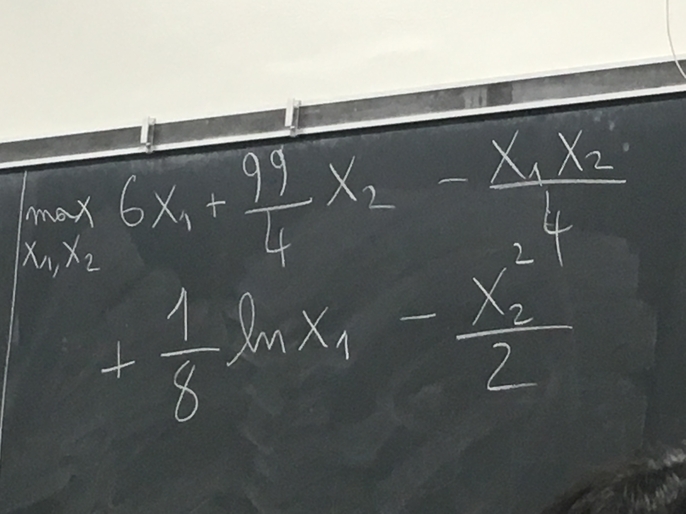
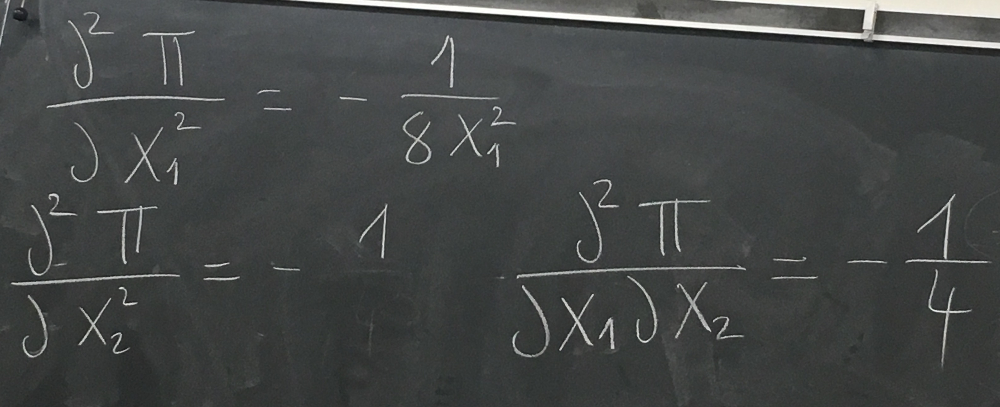
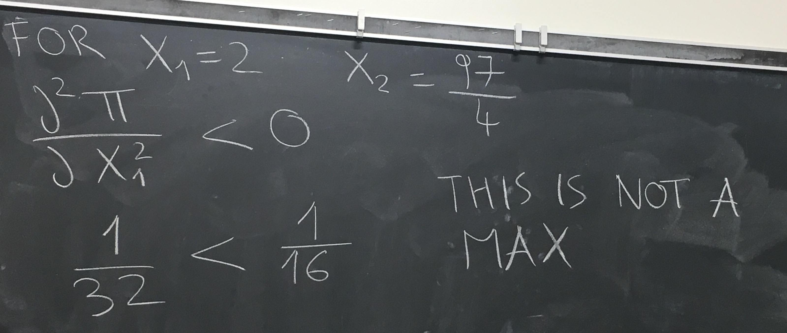
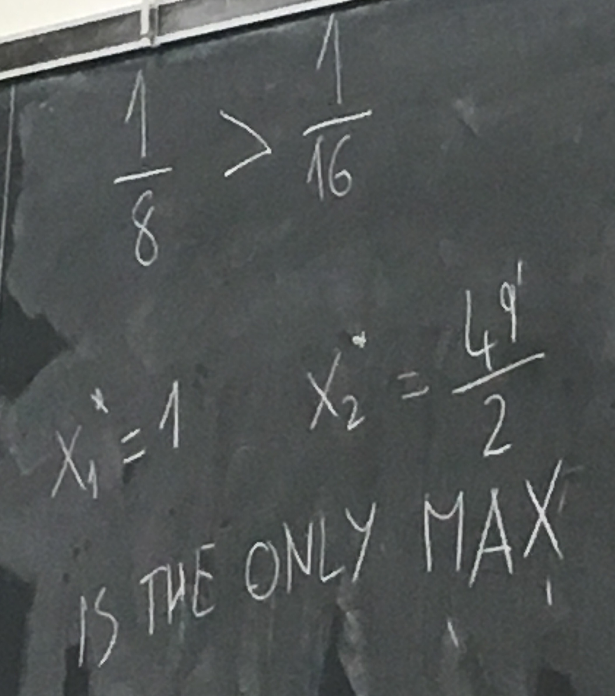

# Discussion 2016/10/4 Tuesday
$\pi = revenue - cost$.     
> Example:      
> $R = 6x_1 + \frac{99}{4}x_2$;    
> $C = \frac{x_1x_2}{4} + ln(\frac{1}{x_{1}^{\frac{1}{8}}}) + \frac{x_2^2}{2}$    
> $max(x_1, x_2) = R - C$      

     
       
       
 
Find the critical points $x_1 = 2 ~ or ~ x_1 = 1, (x_1, x_2) = (2, \frac{97}{4}) ~ or ~ (1, \frac{49}{2})$    
      

$\frac{\partial^2 F}{\partial x_1^2} \lt 0, \frac{\partial^2 F}{\partial x_2^2} \lt 0$     

$\frac{\partial^2 F}{\partial x_1^2} * \frac{\partial^2 F}{\partial x_2^2} \gt (\frac{\partial^2 F}{\partial x_1 \partial x_2})^2$    

     
     
     

Example of consumer problem, **Envelope method**        
to find max of $x_1^{\frac{2}{5}} x_2^{\frac{3}{5}}$     

such that  $p_1x_1 + p_2x_2 = I$.     

$max(x_1, x_2, \lambda):x_1^{\frac{2}{5}}x_2^{\frac{3}{5}} + \lambda(I - p_1x_1 + p_2x_2);$     

$\frac{2x_2}{3x_1} = \frac{p_1}{p_2} \rightarrow x_2 = \frac{3x_1p_1}{2p_2}$       

replace in constraint:
$x_1^* = \frac{2I}{5p_1}, x_2^* = \frac{3I}{5p_2}$          

     

the value of the function:     
$V(x_1^* ,x_2^* ) = (\frac{2I}{5p_1})^{\frac{2}{5}} * (\frac{3I}{5p_2})^{\frac{3}{5}}$      

change in well-being when I changes, $\frac{\partial V(x_1^* ,x_2^* )}{\partial I}$       

**$\rightarrow$ the definition of envelope theorem:**       
derivative of the value of the function =     

$\frac{\partial L(x_1^* ,x_2^* , \lambda)}{\partial I} = (chain ~ rule) = \frac{\partial L}{\partial I} + \frac{\partial L}{\partial x_1} * \frac{\partial x_1}{\partial I} + \frac{\partial L}{\partial x_2} * \frac{\partial x_2}{\partial I} + \frac{\partial L}{\partial \lambda} * \frac{\partial \lambda}{\partial I}$     

then plug in the value of $x_1^* ,x_2^* ~ and ~ \lambda$.
