<!-- TOC depthFrom:1 depthTo:6 withLinks:1 updateOnSave:1 orderedList:0 -->

- [Chapter 1](#chapter-1)
	- [1.2 Interest](#12-interest)
	- [1.3 Accumulation and amount functions](#13-accumulation-and-amount-functions)
	- [1.4 Simple interest / Linear Accumulation Functions](#14-simple-interest-linear-accumulation-functions)
	- [1.5 Compound interest (the usual case)](#15-compound-interest-the-usual-case)
	- [1.6 interest in advance / the effective discount rate](#16-interest-in-advance-the-effective-discount-rate)
	- [1.7 Discount function / The Time value of money](#17-discount-function-the-time-value-of-money)
	- [1.8 Simple Discount](#18-simple-discount)
	- [1.9 Compound Discount](#19-compound-discount)
	- [1.10 nominal rates of interest and discount](#110-nominal-rates-of-interest-and-discount)
	- [1.11 Friendly competition(constant force of interest)](#111-friendly-competitionconstant-force-of-interest)
	- [1.12 force of interest](#112-force-of-interest)

<!-- /TOC -->

# Chapter 1

## 1.2 Interest

* **Interest**, an investment amount $K grow to an amount $S over a period, the interest is the difference $K - $S.
* Charging of interest is based on the **economic productivity of capital** .

|**Investment opportunities theory**  | **Time preference theory**|
|------------- | -------------|
|that you borrow money from bank, the borrowed money allows you to make more money, so you pay a bit back to the bank, as interest.  | that the option to use money immediately, to lend the money out. interest compensates a lender for the loss of choice (immediate money), and the risk of landed money is lost.|
 

## 1.3 Accumulation and amount functions

* Unit of money : dollar, euros, yen, gold pieces.

* **Principal** the investment amount $K of money, or the amount of money borrowed.

* Unit of time : year, month, day, quarter. Time t = 0, is the initial financial transaction, meaning $K is invested at t = 0.     

|**Amount function**  | **$\$A_k(t)$** | principle $\$K, where ~ t \ge 0$|
|------------- | ------------- | -------------|
|**Accumulation function** | **a(t)** | principle is $1.|
`NOTE`: $A_K (t) = K a(t),  A_K (0) = K, a(0) = 1$     
      

* $A_K(t)$  and $a(t)$ are most often **non - decreasing**  functions, if the interest is only paid at the end of each period, then amount functions are **step functions**.
>  An investment of $\$1000$ grows by a constant amount of $\$250$ each year for five year.  
$A_1000(t) = \$1000 + \$250 t$.

| interest paid continuously | interest paid at the end of every year|
|------------- | -------------|
|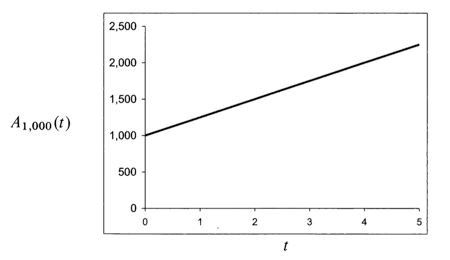 | 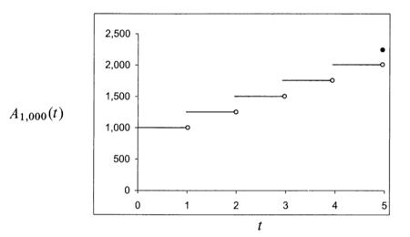|
 

`Effective Interest Rate` for the internal $[t_1, t_2]$:
|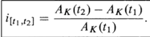 |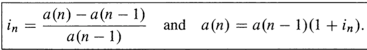|
|------------- | -------------|
 

## 1.4 Simple interest / Linear Accumulation Functions

* $A_K(t) = K(1 + st)$, is the amount function for $\$K$ invested by **simple interest** at rate s.
$a(t) = 1 + st$ , is the simple interest accumulation function at rate s.
 - Decreasing sequence, converge to 0, rarely used for loans of long duration.
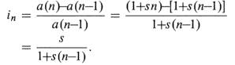     
      

* **Exact simple interest**, actual/actual method, exact days/ days in a year.
 - leap year, can divided by 4, if it can be divided by 100, it need to be divided by 400 to be a leap year.

* **Ordinary simple interest**, 30/360 rule.
 - pretend each month has 30 days and each year has 360 days.

* **Banker's rule**, actual/360, hybrid, exact days / 360

> A borrows $5000 from B on October 14, 1998 at 8% exact simple interest and repay the loan on May 7, 1999. What is the amount of A's repayment?

|Exact simple interest | Ordinary simple interest |
|------------- | ------------- |
|Duration of the loan in days : add exact days to 205 | duration of the loan in days: 6*30 + (30-14) + 7 = 203 |
| repayment = $\$5000 (1 + 0.08* 205/365 )$ | repayment = $\$5000 (1 + 0.08* 203/360 )$ |

 

## 1.5 Compound interest (the usual case)

* want the effective interest rate for the n-th period to be independent of $n$,  $i = i_1 = a(1) - 1$.
 - No advantage nor disadvantages to close and instantly re-open the account.

* **Compound interest** accumulation function at interest rate $i : a(t) = (1 + i)^t, for ~  all ~ t \ge 0$.

* **Greatest integer function**， $[t]$,  greatest integer $\le t$, $f[t]$ is a floor function.
> deposit $12000 at bank, Money receive after 6.5 years is,

|compound interest accumulation function $a(t) = (1.05)^t$ |  accumulation function $a(t) = (1.05)^{[t]}(1 + 0.5( t - [t]))$|
|------- | -------|
|$\$12000(1.05)^{6.5} = \$16478.27$ | $\$12000a(6,5) = \$12000(1.05)^{[6.5]}(1 +0.05(6.5 - [6.5])) ≈ 16483.18$|
 

* **Fiscal policy** refers to the governor's decisions about spending and taxation. Governments spend more will increase the money available to consumers, drives interest down.
* **Monetary policy**, regulation of the money supply and interest rates by a central bank. Federal Reserve (directly control of rates in the Unite States).
* **Federal Funds Rate**, charged for inter bank with U.S. Treasury Securities.
* **Prime rate**, a bank charges to its customer, Federal reserve has less direct influence.
 

## 1.6 interest in advance / the effective discount rate

* **Discount rate**, investor lends $K for one period at a discount rate D, then the borrower will have to pay $K * D   in order to receive the used of $K.
The quantity $KD is called the **amount of discount**.

* **Effective discount rate**,

|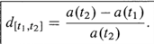 | 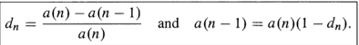|
 |------ | ------|

* **Equivalent rate**,     
$i_n=\frac{d_n}{1-d_n}$, $d_n=\frac{i_n}{1+i_n}$,  $(1+i_n)(1-d_n)=1$.

>  growth of money is governed by the accumulation function a(t) = (1.05)^(t/2) (1+ 0,025t). find d4 and i4 .
>> $a(4) = (1.05)^2 (1.1), a(3) = (1.05)^{\frac{3}{2}} (1.075)$    
$d_4 = a(4) - \frac{a(3)}{a(4)}, i_4 = a(4)-\frac{a(3)}{a(3)}$.

 

## 1.7 Discount function / The Time value of money

1. **discount function**, $v(t)=\frac{1}{a(t)}$

2. **discount factor** ,  compound interest accumulation function $a(t) = (1+i)^t$,
then we define discount factor $v=\frac{1}{1+i}$.
 

3. **present value**, present value of $L to be received in year t
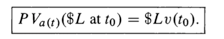
 

4. **Net Present Value**, sequence of investment returns received at time 0, $t_1, t_2, t_3, \ldots, t_n$.
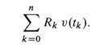     
`use calculator, enter CASH FLOW value then press NPV`     
      

## 1.8 Simple Discount

1. **Simple discount**, when $v(t) = mt + b$ , $v(t)$ is linear.
2. increasing function with asymptote $t = \frac{1}{d}$, there fore the discount not he interval $[0, \frac{1}{d_1})$.

|$A_K(t) = \frac {K}{1-dt}$ | amount function | $K invested by simple discount at rate d|
| ---- | ----- | -----|
|$a(t) = \frac {1}{1-dt}$ |  simple discount accumulation function | $1 is invested at rate d|

 

## 1.9 Compound Discount

**effective discount rate**,     
$d=1-v, v=1-d$, $a(t)=(1+t)^t=(1-d)^{-t}$.     

For borrower, choose low annual effective interest rate, low annual effective discount rate.
 

## 1.10 nominal rates of interest and discount

* bank credit interest more than once per year, **m** times per year.  
* **nominal** (annual) **interest rate** of $i^{(m)}$, convertible, compounded, or payable M times per year.

* **i** is APY,  annual percentage yield.

3. **nominal** (annual) **discount rate** of $d^{(m)}$, convertible, compounded, or payable M times per year.     
      

$d^{(m)}= \frac{i^{(m)}}{1+ \frac{i^{(m)}}{m}}$     

$d = 1- (1- \frac{d^{(m)}}{m})^{m}$     

$i^{(m)}= \frac{d^{(m)}}{1- \frac{d^{(m)}}{m}}$     

$i = (1+ \frac{i^{(m)}}{m})^{m}-1$     

 

`2nd-ICONV to calculate NOM and EFF`     
      

## 1.11 Friendly competition (constant force of interest)

1. force of interest:     
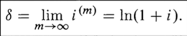
and
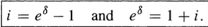, and 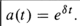
 

## 1.12 force of interest

1. force of interest

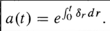
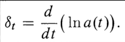
 
