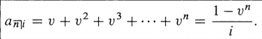
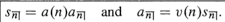
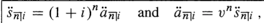
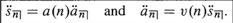
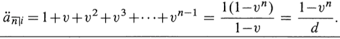
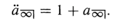

<!-- TOC depthFrom:1 depthTo:6 withLinks:1 updateOnSave:1 orderedList:0 -->

- [Chapter 3 Annuities](#chapter-3-annuities)
	- [3.1 introduction:](#31-introduction)
	- [3.2 Annuities - immediate, at the **end** of each payment period.](#32-annuities-immediate-at-the-end-of-each-payment-period)
	- [3.3 Annuities - due, at the **beginning** of each payment period.](#33-annuities-due-at-the-beginning-of-each-payment-period)
	- [3.4 Perpetuity, annuity with an **infinite** term.](#34-perpetuity-annuity-with-an-infinite-term)
	- [3.5 Deferred annuities and values on any date](#35-deferred-annuities-and-values-on-any-date)
	- [3.6 Outstanding loan balance](#36-outstanding-loan-balance)
	- [3.7 Non-level Annuities](#37-non-level-annuities)
	- [3.8 Annuities with payments in geometry progression:](#38-annuities-with-payments-in-geometry-progression)
	- [3.9 Annuities with payments in arithmetic progression:](#39-annuities-with-payments-in-arithmetic-progression)
	- [3.10 Yield rate](#310-yield-rate)
	- [3.11](#311)

<!-- /TOC -->

# Chapter 3 Annuities  

## 3.1 introduction:     
* **Annuity** is the series of payments made at specified intervals for a fixed or continent period.     
> repayment of loan;     
> deposits to a retirement fund;     

* **Payment period** , the interval.     
*

## 3.2 Annuities - immediate, at the **end** of each payment period.      
present value of the basic annuity immediate lasting n period equals the sum of the present value of the $n$ end-of-period payments, $v(1) + v(2) + \ldots + v(n)$.      
     
     

## 3.3 Annuities - due, at the **beginning** of each payment period.       
      
     
     

## 3.4 Perpetuity, annuity with an **infinite** term.       
     

## 3.5 Deferred annuities and values on any date      
1. retrospective method     

## 3.6 Outstanding loan balance     

## 3.7 Non-level Annuities

## 3.8 Annuities with payments in geometry progression:     

## 3.9 Annuities with payments in arithmetic progression:     

## 3.10 Yield rate     

## 3.11
