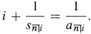

<!-- TOC depthFrom:1 depthTo:6 withLinks:1 updateOnSave:1 orderedList:0 -->

- [Chapter 3 Annuities](#chapter-3-annuities)
	- [3.1 introduction:](#31-introduction)
	- [3.2 Annuities - immediate,](#32-annuities-immediate)
	- [3.3 Annuities - due](#33-annuities-due)
	- [3.4 Perpetuity](#34-perpetuity)
	- [3.5 Deferred annuities and values on any date](#35-deferred-annuities-and-values-on-any-date)
	- [3.6 Outstanding loan balance](#36-outstanding-loan-balance)
		- [Retrospective method:](#retrospective-method)
		- [Prospective method:](#prospective-method)
	- [3.7 Non-level Annuities](#37-non-level-annuities)
	- [3.8 Annuities with payments in geometry progression * :](#38-annuities-with-payments-in-geometry-progression-)
	- [3.9 Annuities with payments in arithmetic progression + :](#39-annuities-with-payments-in-arithmetic-progression-)
		- [annuity-immediate:](#annuity-immediate)
		- [annuity-due:](#annuity-due)
	- [3.10 Yield rate](#310-yield-rate)
	- [3.11 annuity symbols for non-integral terms](#311-annuity-symbols-for-non-integral-terms)
		- [Drop payment](#drop-payment)
		- [Balloon payment](#balloon-payment)

<!-- /TOC -->

# Chapter 3 Annuities  

## 3.1 introduction:

* **Annuity** is the series of payments made at specified intervals for a fixed or continent period.     
	`e.g.` repayment of loan, or deposits to a retirement fund;     
* **Payment period** , the interval.         

## 3.2 Annuities - immediate,
`Pay at the END of each payment period, receive first payment at the end of first payment period.`     

* Basic annuity immediate lasting $n$ period, with level payment \$1.      
* The Present value of basic annuity immediate equals the sum of the present value of the $n$ end-of-period payments:     
$v(1) + v(2) + \ldots + v(n)$.  
   
  * when it is compound interest at an effective rate of $i$ per period, $v(t) = (1+i)^{-t}= v^t$     
	therefore the sum is  $v+v^2+v^3+\ldots+v^n$.     
      

* Geomatric series: $c+cr+c^2+ \ldots +cr^{n-1} = \frac{c(1-r^n)}{1-r}$.     
  &rarr; the present value of the basic annuuity-immediate lasting $n$ interest periods      
 
$v+v^2+v^3+\ldots+v^n=\frac{v(1-v^n)}{1-v}=\frac{1-v^n}{i}$.   
   

* Present value symbol a${\overline{n|}}i$.      
     
* Compound interest annual effective rate:     
a${\overline{n|}}i$$=v+v^2+v^3+\ldots+v^n=\frac{1-v^n}{i}$.   
    
* Final payment is S${\overline{n|}}i$, measure teh value $n$ period after.
   
* When $a(n)=(1+i)^n$, compound interest rate, S${\overline{n|}}i$$=(1+i)^n$, $a$ ${\overline{n|}}i$, and  $a$ ${\overline{n|}}i$ $=v^n$S${\overline{n|}}i$.     
   
* In General: S${\overline{n|}}i$$=a(n)$ $a$ ${\overline{n|}}$, and $a$ ${\overline{n|}}$ $=v(n)$ S${\overline{n|}}$.   
   
* S${\overline{n|}}i$$=\frac{(1+i)^n-1}{i}$     
   
* PMT ＝ FV／a${\overline{n|}}i$     
If future value (Loan)is to be repaid by n level end-of-period PMT, with effective interest rate for the payment period is $i$.

* PMT ＝ FV／S${\overline{n|}}i$    
If future value is to be accumulated by n level end-of-period PMT, with effective interest rate for the payment period is $i$.

* 

* Calculator, calculate without BGN on the top, meadning the payment is given at the end of period. `See page p120`.     
  * I/Y, interest rate per year, nominal interest rate, as percentage;
  * P/Y, payments per year;     
  * C/Y, the number of interest conversion period per year.

## 3.3 Annuities - due     
`Pay at the BEGINNING of each payment period.`

* ${\ddot  {a}}$ ${\overline{n|}}i$, represents the value at (first payment time) that lasts $n$ periods.   (present value).
* ${\ddot  {S}}$ ${\overline{n|}}i$, represents the value (at the end) that lasts $n$ periods.   
* ${\ddot  {S}}$ ${\overline{n|}}i$ $=(1+i)^n$ ${\ddot  {a}}$ ${\overline{n|}}i$,
and ${\ddot  {a}}$ ${\overline{n|}}i$ $=v^n$ ${\ddot  {S}}$ ${\overline{n|}}i$.     
   
* In General: ${\ddot  {S}}$ ${\overline{n|}}$$=a(n)$ ${\ddot  {a}}$${\overline{n|}}$, and ${\ddot  {a}}$${\overline{n|}}$ $=v(n)$ ${\ddot  {S}}$ ${\overline{n|}}$.   
   
* Compound interest annual effective rate:     
${\ddot  {a}}$ ${\overline{n|}}i$$=v+v^2+v^3+\ldots+v^n=\frac{1-v^n}{d}$.   
       
* $v+v^2+v^3+\ldots+v^{n-1}=\frac{1(1-v^n)}{1-v}=\frac{1-v^n}{d}$.       
* ${\ddot  {S}}$ ${\overline{n|}}i$$=\frac{(1+i)^n-1}{d}$     
   
`Note:`  
 
* ${\ddot  {a}}$ ${\overline{n|}}i$ $=(1+i)$ a${\overline{n|}}i$     
 
${\ddot  {S}}$ ${\overline{n|}}i$ $=(1+i)$ S${\overline{n|}}i$      
      

* ${\ddot  {a}}$ ${\overline{n|}}i$ $=$ a${\overline{n-1|}}i$ $+1$     
       
${\ddot  {S}}$ ${\overline{n|}}i$ $=$ S${\overline{n+1|}}i$ $-1$

## 3.4 Perpetuity
`annuity with an infinity term`.     
* infinite payment periods, ${\ddot  {a}}$ ${\overline{∞|}}i$ $=$ a${\overline{∞|}}i$ $+1$     

* ${\ddot  {a}}$ ${\overline{∞|}}i$ $=\frac{1}{d}$     
* a${\overline{∞|}}i$ $=\frac{1}{i}$     
      

## 3.5 Deferred annuities and values on any date      
* A wait of more than one payment period for a payment. retrospective method     
* times $v^n$

## 3.6 Outstanding loan balance     
how to find loan balance at an intermediate date between the loan origination date and the date of the final payment.      

### Retrospective method 回顾法:     
$L$, the amount to be paid at the end of $n$ times period.      
$i$, effective interest rate per payment,     
loan balance at time $k$ is $L(1+i)^k$.      
$OLB_k$ the loan balance at the end of k payment period(right after k payment),      
$Q$ is each payment of first $k$ period.     
&rarr;  $OLB_k=L(1+i)^k-Q$ S${\overline{n|}}i$.     
      

### Prospective method:     
$OLB_k$, the remaining value after time $k$ payment.     
$Q$, the amount of all but last payment     
$R$, last payment.     
$OLB_k=Q$ a${\overline{n-k-1|}}i$ $+R(1+i)^{n-k}$.     
when all payments are equal $OLB_k=Q$ a${\overline{n-k|}}i$.          
         

## 3.7 Non-level Annuities
use CASHFLOW.     

## 3.8 Annuities with payments in geometry progression * :     
* $(1+g)$ times its predecessor, $i$, effective interest rate for the payment period. $n$, payment period.      
annuity one period before the first payment is      
  $P(\frac{1- \frac{1+g}{1+i}^n }{i-g})$     
      

## 3.9 Annuities with payments in arithmetic progression + :     
At the end of $j^{th}$ interest period, $P$, the first payment, **increased** by constant amount of $Q$,     

### annuity-immediate:           
PV = $(I_{P,Q} a)$${\overline{n|}}i$ $=P a$ ${\overline{n|}}i$ + $\frac{Q}{i}($ a ${\overline{n|}}i$ $-nv^n)$.     
 
FV = $(I_{P,Q} S)$${\overline{n|}}i$ $=P S$ ${\overline{n|}}i$ + $\frac{Q}{i}($ S ${\overline{n|}}i$ $-n)$.     

* when $P=Q=1$, PV = $(Ia)$${\overline{n|}}i$, FV = $(I S)$${\overline{n|}}i$.      
* when $P=n, Q=-1$, decreasing annuity, payment is $n, n-1, n-2, \ldots 2,1$     
  $(D a)$${\overline{n|}}i$ $=n$ a${\overline{n|}}i$ $-\frac{1}{i}($ a${\overline{n|}}i$ $-nv^n)$ =$(n-a$ ${\overline{n|}}i$ $)/i$     
 
$(D S)$ ${\overline{n|}}i$$=(D a)$ ${\overline{n|}}i$ $(1+i)^n$.     
      

### annuity-due:          
PV = $(I_{P,Q} {\ddot  {a}})$${\overline{n|}}i$ $=P  {\ddot  {a}})$ ${\overline{n|}}i$ + $\frac{Q}{d}(a$ ${\overline{n|}}i$ $-nv^n)$.     
  FV = $(I_{P,Q} {\ddot  {S}})$${\overline{n|}}i$ $=P  {\ddot  {S}})$ ${\overline{n|}}i$ + $\frac{Q}{d}(s$ ${\overline{n|}}i$ $-n)$.     

* when $P=Q=1$,      
PV = $(I {\ddot  {a}})$${\overline{n|}}i$,      
  FV = $(I {\ddot  {S}})$${\overline{n|}}i$ $=({\ddot  {S}}$ ${\overline{n|}}i$$-n)/d$;        

* when $P=n, Q=-1$, decreasing annuity, payment is $n, n-1, n-2, \ldots 2,1$     
PV = $(D {\ddot  {a}})$${\overline{n|}}i$$=(n-a$ ${\overline{n|}}i$ $)/i$,

`Note:`     
$(Ia)$${\overline{n|}}i$ $+(D a)$${\overline{n|}}i$ $=(n+1)a$${\overline{n|}}i$,     
$(I {\ddot  {a}})$${\overline{n|}}i$ $+(D {\ddot  {a}})$${\overline{n|}}i$ $=(n+1){\ddot  {a}}$${\overline{n|}}i$     
      

## 3.10 Yield rate     
* guess and check
* Newton's method
* TVM worksheet, use CASHFLOW.     

## 3.11 annuity symbols for non-integral terms     
1. positive real number $r$, then, we have $a$${\overline{r|}}i$ $=\frac{1-v^{r}}{i}$,      
let $L$ be the total amount and $Q$ be **end-of-period payment**, with $i$ effective interest rate.     

2. then when we calculate $r*lnv =ln(1-\frac{iL}{Q})$, $r$ may be not an integer.     

3. Therefore we re-write $r=n+f$, where n is an integer and $0≤f≤1$.     

4. $L=Qa$${\overline{n|}}i$ $+Q(\frac{(1+i)^f-1}{i})v^r$     

### Drop payment
* make $n$ payment of $Q$, then make the $n+1$ -th payment of $Q(\frac{(1+i)^f-1}{i})(1+i)^{1-f}$     
The last time smaller payment is drop payment.
      

### Balloon payment     
* make $n-1$ payment of $Q+Q(\frac{(1+i)^f-1}{i})v^f$.     
The last larger payment is ballon payment.
