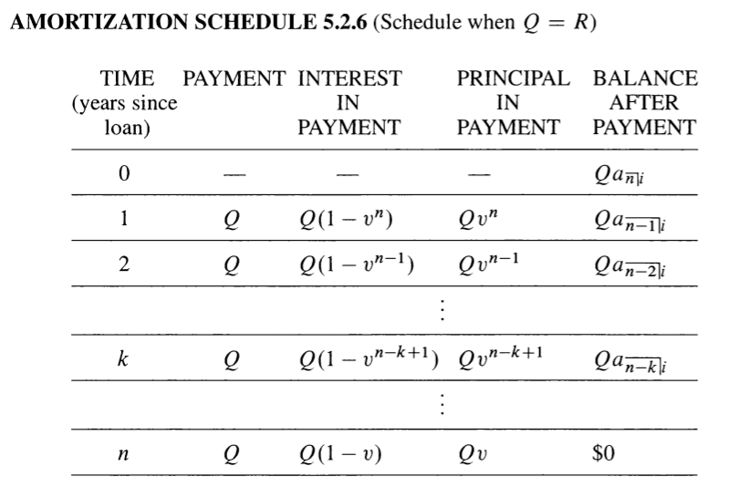

# Chapter 4
## 4.2 Payment less frequent than interest period.
One payment period $r$ = Several interest periods $k$.
* total times $n$, $n=rk$.
* Calculate $I=(1+i)^k-1$,interest rate per payment period.
Since there is **k** times interest periods in $1$ payment period.
 
### Annuity Immediate:
1. Present Value is $a$ ${\overline{r|}}I$ = a${\overline{n|}}i$ / $S$${\overline{k|}}i$
 

2. Feture Value is $S$ ${\overline{r|}}I$ = S${\overline{n|}}i$ / $S$${\overline{k|}}i$
 

3. $(1+I)^r=(1+i)^n$

### Annuity Due:
1. ${\ddot  {a}}$ ${\overline{r|}}I$ = $a$ ${\overline{n|}}i$ / $a$ ${\overline{k|}}i$
 

2. ${\ddot  {S}}$ ${\overline{r|}}I$ = $S$ ${\overline{n|}}i$ / $a$ ${\overline{k|}}i$
 

3. ${\ddot  {a}}$ ${\overline{r|}}I$ = $(1+I)a$ ${\overline{r|}}I$
 

### Perpetuity:
$a$ ${\overline{∞|}}I$ = 1/ a${\overline{k|}}i$
 

## 4.3 Annuity with payments More frequent than each interest period:
One interest periods = Multiple payment periods.
1. determine payment period rate, $J=(1+i)^{\frac{1}{m}}-1=\frac{i^{(m)}}{m}$

# chapter 5, Loan Repayment     

## 5.2 Amortized loans and Amortization Schedule 分期付款:     
N number of years
m number os compound payment per year.
principal payment = payment amount - interest;     

* **Amortization schedule** shows the time and amount of each payment, devision of the payment into interest and principal, and the OLB after each payment.     
`loan, -PV, FV = 0`     

     
      
**Amortization schedule R<Q**      

     
      
