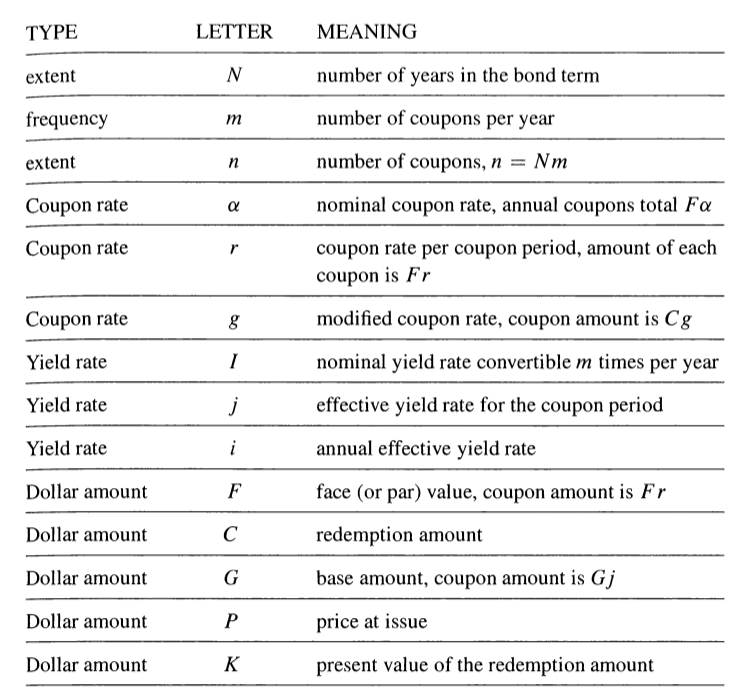
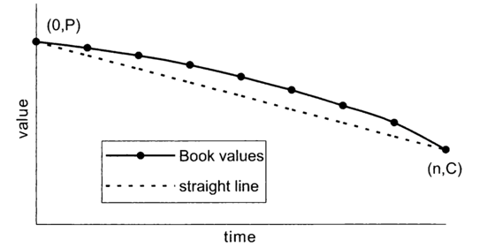
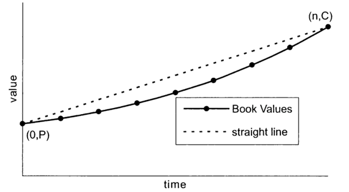
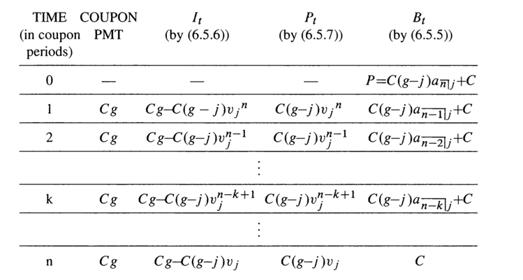
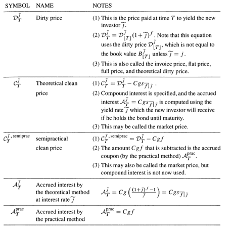

<!-- TOC depthFrom:1 depthTo:6 withLinks:1 updateOnSave:1 orderedList:0 -->

- [Chapter 6 Bonds](#chapter-6-bonds)
	- [6.1 introduction](#61-introduction)
	- [6.2 bonds alphabet soup and the basic price formula:](#62-bonds-alphabet-soup-and-the-basic-price-formula)
	- [6.3 The premuim-discount formula](#63-the-premuim-discount-formula)
	- [6.4 Other price formulas](#64-other-price-formulas)
	- [6.5 Bond Amortization Schedule](#65-bond-amortization-schedule)
		- [Premium bonds (writing down):](#premium-bonds-writing-down)
		- [Discount bonds (writing up):](#discount-bonds-writing-up)
		- [Bond with level coupons:](#bond-with-level-coupons)
	- [6.6 Value of Bond after issuing](#66-value-of-bond-after-issuing)
	- [6.7 Sell a Bond after issuing](#67-sell-a-bond-after-issuing)
	- [6.8 Yield rate example](#68-yield-rate-example)
	- [6.9 Callable bond](#69-callable-bond)
		- [European option](#european-option)
		- [Bermuda option](#bermuda-option)
		- [American option](#american-option)

<!-- /TOC -->
# Chapter 6 Bonds

## 6.1 introduction
* **bonds:** government issued,
* last payment occurs at **maturity date / redemption date**
* purchase date is called **issue date**,
* **term:** intervel

* maturity date is fixed, then the bond is **noncallable**,

* a single payment at a fixed maturity date, it is called **zero-coupon bonds / (pure) discount bonds**

* a sequence of payment prior to and at the redemption date **coupon bonds**, as well as an redemption payment additionally.

* length of the interval between coupon payments is **coupon period**, usually semiannual , half a year;

* **indenture** is the legal document that specifies the term and conditions of a particular bond;     
 

## 6.2 bonds alphabet soup and the basic price formula:
* **Face value / Par value** $F$, calculate the size of the coupon payments, not the price investor pay, not the redemption value of the bond at maturity.

* $\alpha$, the nominal rate convertible $m$ times per year, $m$ is the number of coupons each year.

* Set $r=\frac {\alpha}{m}$, **r** is the effective rate for the coupon period.

* both $\alpha$ and **r**  are sometimes called **Coupon Rates**.

* Amount of each payment is $Fr=\frac{F \alpha}{m}$.     

* let $n$ denoted the numbers of coupon periods in the term of the bond. if it is an **N-** year bond, $n= Nm$.

* $C$ id the redemption amount , the bond holder receives at the bonds maturity date, excluding the regular coupon amount.       

* If $F=C$, the bond is said to be a **par value bond / redeemable at particular**.     
`if no redemption amount is specified, assume the bond is a par-value bond.`     

* **Modified Coupon Rate** $g=\frac{Fr}{C}$.     

* Annual effective yield rate $i$, investor's effective yield rate per coupon period $j$, and $i=(1+j)^m-1$, usually, the yield rate is specifies as a nominal rate $I$, convertible $m$ times per year, $j=\frac{I}{m}$, and $i = (1+ \frac{I}{m})^m -1$

* **Base Amount** $G$ is the amount you need to invest now, at interest $j$, to create a perpetuity paying an amount of interest at the end of each coupon period that is equal to the coupon amount. $G$ expresses the coupon amount in terms of the yield rate per coupon period $j$. $G=\frac{Fr}{j}$  .

* The amount of each coupon payment is $Fr=Cg= Gj$.     

* Price paid for the bond to yield the investor $j$ per interest period, $v_j = (1+j)^{-1}$.     

* Set $K=Cv_j^n$, the value of the redemption at the issue date figured using compound interest and the yield rate received by th e investor.         

  

* **Basic price formula** $P = (Fr)a$ ${\overline{n|}}j$ $+Cv_j^n = (Fr)a$ ${\overline{n|}}j$ $+K$.      

      

## 6.3 The premuim-discount formula
$P = (Fr)a$ ${\overline{n|}}j$ $+Cv_j^n$ $= (Cg)a$ ${\overline{n|}}j$ $+C(1- ja$ ${\overline{n|}}j$ $)$.     

* **Premium-discount pricing formula** $P = C+ C(g-j)a$ ${\overline{n|}}j$      

* **Sell at a premuim** if the price $P$ is greater than the redemption value $C$, **premium / amount of premium** $=P-C$, $g>j$.     

* **Sell at a discount** if the price $P$ is less than the redemption value $C$, **discount / amount of discount** $=C-P$, $j>g$.     

* Premium $= P-C = C(g-j)a$ ${\overline{n|}}j$      

* Discount $= C-P = C(j-g)a$ ${\overline{n|}}j$      
      

## 6.4 Other price formulas    
* From the base amount formula we can get:   

  - a${\overline{n|}}j$ $=\frac{1-v^n_j}{j}$   

  - $Cv_j^n = K$     

* $P = (C-G)v^n_j +G$     

* $P= Cg \frac{1-v^n_j}{j} +Cv_j^n = \frac{g}{j} C(1-v_j^n) +Cv_j^n$     

* Makeham's Formula: $P = \frac{g}{j} (C-K)+ K$       
      

## 6.5 Bond Amortization Schedule     
* The applicable interest rate for each interest period is $j$.      

* Set **book value** $B_t$ **the balance of the debt at time t**, immediately after any time t coupon payment, before redemption payment.     

* $B_0 =P$, and $B_n =C$

* **interest due** at time t,      
$I_t = jB_{t-1}=Cg - C(g-j) v_j^{n-t+1}$     

* **amount for adjustment of principal**      
$P_t = B_{t-1} - B_t = C(g-j)v_j^{n-t+1}$     

* $I_ t+ P_t = Cg$      
  - premium: $P_t$ is positive;     
  - discount: $P_t$ is negative;     
  - price equals the redemption value, $P_t=0$.     

* $B_t = (1+j)B_{t-1} - Cg$      

* $B_t= Fr a$ ${\overline{n-t|}}j$ $+Cv_j^{n-t}$          

* $B_t= C(g-j)a$ ${\overline{n-t|}}j$ $+C$     

### Premium bonds (writing down):
      

### Discount bonds (writing up):
     

### Bond with level coupons:    

      

## 6.6 Value of Bond after issuing     
* **Value** with respect of interest rate $j$(effective yield rate per coupon period) price paid for the bond;     

* **dirty value/ theoroetical dirty value**: $D_T = B_T, 1≤T≤n$.     
`discountinue`

* clean value continues function.     
      

## 6.7 Sell a Bond after issuing     
* price of bond purchased **cum divident** $= D^{j^{-}}_T$      

     

## 6.8 Yield rate example     

## 6.9 Callable bond      
* With **agreement / call provision**, allow the issuer to hasten the repayment of the debt.
* at designated **call date**, **lockout period**,     

### European option     
single call date prior to maturity;      
wait until the date;     

### Bermuda option     
Multiple specified date, coincide with coupon dates;     
wait until certain day;    

### American option       
Callable at any time following the lockout period.     
any day      
