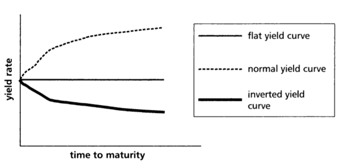

<!-- TOC depthFrom:1 depthTo:6 withLinks:1 updateOnSave:1 orderedList:0 -->

- [8.3 the term structure of interest rates:](#83-the-term-structure-of-interest-rates)
	- [Zero coupon bonds, $t>0$;](#zero-coupon-bonds-t0)
- [9.2 Duration](#92-duration)

<!-- /TOC -->

# 8.3 the term structure of interest rates:
interest rate varies with the investment term.     

**Pure expectation theory:**     
view a sequence of short term bonds as a perfect substitute for a single longterm bond.     

**Liquidity preference theory:**    
* invest money for a sequence of short period so that the money is frequently accessible.     

* issuers must offer long-term-bonds with higher rates, called **liquidity premium**     

**Preferred habitat theory:**     
* Investor's own preferred investment term, but may be induced (感应) to leave their preferred habitat if the compensated yield rates are sufficiently higher, called **term premium**.      

**Market segmentation theory:**     
not one market, divided into separate market for each term.

**Yield curve to see one's annual yield rate.**     
     

## Zero coupon bonds, $t>0$;     
* **spot rate / zero-coupon rate** $r_t$ is the annual effective interest rate earned by money invested at time 0 for a period of t years.     
$(1+r_t)^t=1+i_{[0,t]}$      

* **Treasury bills**, matures of one year or less, zero coupon bonds, semiannual coupons.
  - if spot rate is more than one year, based on treasury securities, we need to remove coupons.
  (transfer a coupon bond unto a sequence of zero coupon bonds with different terms, called **strips**)

* K$ invested at time 0 grows to $K(1+r_t)^t$ at time t.     
if $s>t$, investment grows to $K(1+r_s)^s$ at time s.     
The annual effective interest rate foe the interval $[t,s]$ is $f_{[t,s]}$, such that $(1+f_{[t,s]}^{s-t}) = \frac{(1+r_s)^s}{(1+r_t)^t}$      

* $f_{[0,s]} = r_s$     

* $f_{[t,s]}$ the **theoretical forward rate / implied forward rate**.     

# 9.2 Duration     
Assumption: compound interest, spot rate are all equal, if one spot rate changes, all change to remain a equal spot rate(parallel shifts).     

Present Value $P(i)= \Sigma_{t≥0} C_t (1+i)^{-t}$     

$\frac{P(i)-P(i_0)}{P(i_0} = \frac{P^,(i_0)}{P(i_0)}(i-i_0)$     

* when $i>-1$, **modified duration** $D(i,1) = - \frac{P^,(i_0)}{P(i_0)}$     

* $D(i,m) = - \frac{\frac{dP}{di^{(m)}}}{P(i_0)}, i^{(m)} = m[(1+i)^{\frac{1}{m}}-1]$     

* $D(i,m)(1+\frac{i^{(m)}}{m})= D(i,1)(1+i)$      

* $D(i,\infinite)= D(i,1)(1+i)$     
