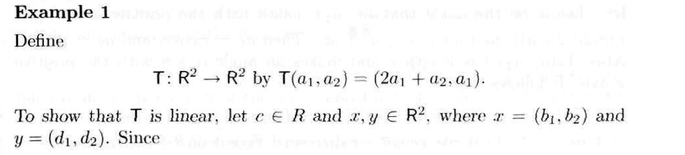
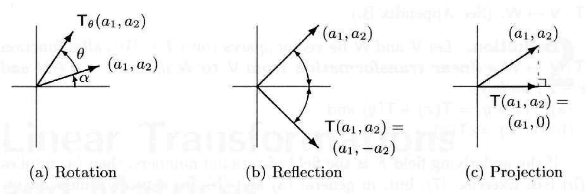

<!-- TOC depthFrom:1 depthTo:6 withLinks:1 updateOnSave:1 orderedList:0 -->

- [如何更好的理解的Chapter2.1](#如何更好的理解的chapter21)
	- [概念](#概念)
		- [Transformation](#transformation)
		- [Null Space](#null-space)
		- [Range](#range)
		- [Nullity](#nullity)
		- [Rank](#rank)
		- [Dimension Theorem](#dimension-theorem)
		- [Example](#example)

<!-- /TOC -->

# 如何更好的理解的Chapter2.1
---

## 概念
---
### Transformation    

   中文名是 `变换`，英文简称是`T` 先看书上定义： $\color{#FF0}{V}$ 和 $\color{#0F0}{W}$ 是 $\color{#0FF}{F}$ 上的`Vector Space`    

   1. 比如 一个向量 $\vec{a_1} = (1 ,2 ,3)$ 变成 $\vec{a_2} = (2,4,6)$ 就是一个变换（向量里面每个值`*2`）。 此时 $\color{#FF0}{V}$ 就是 $\color{#FF0}{R^3}$， $\color{#0F0}{W}$ 就是 $\color{#0F0}{R^3}$， $\color{#0FF}{F}$ 自然就是实数了 $\color{#0FF}{R}$ 。这里的公式可以写成： $T:\color{#FF0}{R^3} \rightarrow \color{#0F0}{R^3}$ 同时 $T(\vec{a_1}) = \vec{a_2}$  

   2. 当然，也可以变成 $\vec{a_3} = (1,2)$。这个就是变换把一个三维的变为了一个二维向量了。此时 $\color{#FF0}{V}$ 就是 $\color{#FF0}{R^3}$， $\color{#0F0}{W}$ 就是 $\color{#0F0}{R^2}$， $\color{#0FF}{F}$ 自然就是实数了 $\color{#0FF}{R}$ 。 这里的公式可以写成： $T:\color{#FF0}{R^3} \rightarrow \color{#0F0}{R^2}$ 同时 $T(\vec{a_1}) = \vec{a_3}$     

   这里就有一个`linear transformation`的概念，就是说这个`Transformation` `T` 不是可以计算 $\color{#FF0}{V}$ 里面的向量么？只要满足对 $\color{#FF0}{V}$ 里面所有的向量（此处用 $\vec{x} ~ \vec{y}$ ）都可以这么写：
   1. $T(\vec{x}+\vec{y}) = T(\vec{x}) + T(\vec{y})$

   2. $T(c\vec{x}) = cT(\vec{x}), c \in \color{#0FF}{F}$     

   这个变换就叫做`linear transformation`，比如我们以刚刚那个 $\vec{a_1} = (1 ,2 ,3)$ 变成 $\vec{a_2} = (2,3,4)$ 的变换举个例子。我们随便从 $\color{#FF0}{V}$ 也就是 $\color{#FF0}{R^3}$ 取两个`vector`, 分别是 $\vec{x} = (1,1,1)$ 和 $\vec{y} = (2,2,2)$  当然 $\vec{x}+\vec{y} = (3,3,3)$ 。然后你看， $T(\vec{x} + \vec{y}) = (6,6,6)$， $T(\vec{x}) = (2,2,2)$ ， $T(\vec{y}) = (4,4,4)$ 加起来就是 $(6,6,6)$ 你看就是 $T(\vec{x} +\vec{y})$ 对吧。同理对第二个式子也成立，所以这个把一个向量里面每个值都乘以2的这个`Transformation`，就是一个`Linear Transformation`。

* `Linear Transformation`的本质

  **对于向量运算来说 $\color{red}{所有的~Linear~Transformation~本质上就是一个矩阵！}$**

  > 这就涉及到为什么书上不这么说了，因为只是对于向量来说每一个`T`就是可以等价为一个矩阵，但是毕竟我们的`Space`不一定是矩阵呀。所以才要用一个抽象的`T`来代替。你需要把`T`理解为一种`运算`，矩阵只是一种其中一种针对`vector`的运算。

  > 毕竟你说一个`Matrix`乘一个`vector` 变成另外一个`vector` 这个不就和 一个数 `x` 在函数 `f(x)` 作用下变成 `y` 一个意思么？对吧。所以一个`T`也可以理解为一个`function`

  我们就从这个角度开始看接下来的东西，首先解释一下为什么就是一个矩阵，`pdf`上`P77` (书上`P65`)有一个 `Example`，如下：

  

  当然这道题是让你证明这个`Transformation`是`Linear`的。你看呀，这个是一个二维`vector`到二维`vector`的变换对吧。我们假设有个向量 $\vec{x} = (a_1, a_2)$，那么这个`Transformation`等价于在这个`vector`之前给他乘以了一个矩阵：

  \[

  \left ( \begin{matrix}
  2 & 1 \\
  1 & 0  
  \end{matrix}\right )

  \left ( \begin{matrix}
  a_1 \\
  a_2  
  \end{matrix}\right )

  =

  \left ( \begin{matrix}
  2a_1 + a_2 \\
  a_1  
  \end{matrix}\right )
  \]

  你看是不是，把 $a_1$ 变成 $2a_1+a_2$ 然后把 $a_2$ 变成 $a1$ 是吧。于是，所有的`Linear Transformation` 都本质上是一个`Matrix`！

  比如，针对下图的几个`Transformation`：

  

  其中`T`不久分别是

  \[

  \left ( \begin{matrix}
  \cos(\theta) & -\sin(\theta) \\
  \sin(\theta) & \cos(\theta)  
  \end{matrix}\right )

  \left ( \begin{matrix}
  1 & 0 \\
  0 & -1  
  \end{matrix}\right )

  and

  \left ( \begin{matrix}
  1 & 0 \\
  0 & 0  
  \end{matrix}\right )

  \]

  所以！以后看到`Linear Transformation`就可以想到这是一个`Matrix`！

### Null Space

这个中文叫做`零空间`，不过这个不重要。这个`Null Space`是干嘛的呢，就是对一个`Linear Transformation` `T` 假设有一个 `vector` $\vec{x}$ 都可以有 $T(\vec{x}) = \vec{0}$ 也就是说 所有被这个`T`变换之后等于零向量 $\vec{0}$ 的所有 $\vec{x}$ 的`Space`，就叫做 `Null Space`。例如：

就用上面那个`Example-1`的例子：

$$T =
\left ( \begin{matrix}
2 & 1 \\
1 & 0  
\end{matrix}\right )
$$

此时假设 $\vec{x} = (a, b)$ 然后列方程：

$$T(\vec{x}) =
\left ( \begin{matrix}
2 & 1 \\
1 & 0  
\end{matrix}\right )
*
\left ( \begin{matrix}
a  \\
b   
\end{matrix}\right )
=
\left ( \begin{matrix}
0  \\
0   
\end{matrix}\right )
$$

算出来 $a=0, b=0$ 所以这个方程只有一个解，也就是 $\vec{x} = (0, 0)$ 所以这时候，说明 `T` 的解空间就只有一个值 $\vec{x} = (0, 0)$ 此时这个只有一个 `0` 的空间的维数 毫无疑问就是 `0`。这里记作`T`的`Null Space`是 $\color{teal}{N(T)}$

### Range

这个中文叫作`值域`，一个`Linear Transformation`的`Range`，也就是一个`Matrix`的`Range`。

不是 $T: V \rightarrow W$ 么，其中对所有的 $\vec{x} \in V$ ，所有的 $T(\vec{x})$ `span`的`space` 就是这个 `T` 的 `Range`。 `Range`是一个 `Space`。记作 $\color{#0FF}{R(T)}$ 。比如，

$T: V \rightarrow W$ 其中 $(\beta_1,\beta_2,\beta_3,\ldots,\beta_n)$ 是 $V$ 的一组 `basis`，那么这些`basis`不是经过`T`的变换变成了 $(T\beta_1,T\beta_2,T\beta_3,\ldots,T\beta_n)$ 了么？这些作为`basis ``span`的一个新的`space`就叫做`T`的`Range`。

### Nullity

刚刚我们说到`零空间` `Null Space` 对吧，这个是一个 `Space` 所以是有 `Dimension` `维数` 的是吧。那么这个 `Null Space` 的 `Dimension` 就是叫做 `Nullity` 中文叫做 `零化度`。记作 $\color{teal}{\dim(N(T))}$

### Rank

刚刚我们说到`值域` `Range` 对吧，这个也是要给 `Space` 所以也是有 `Dimension` `维数` 的，于是 `Null Space` 的 `Dimension` 就是叫做 `Rank` 中文叫做 `秩`。 记作 $\color{#0FF}{\dim(R(T))}$

### Dimension Theorem

这个中文叫做 `秩-零化度定理`，解释的就是上面几个概念之间的联系。

$$
nullity(T) + rank(T) = \dim(V) \\
\iff (等价于) \\
\dim(N(T)) + \dim(R(T)) = \dim(V)
$$

这句话翻译一下就是： 一个`变换` `零空间`的`维数` + 这个`变换` `值域` 的 `维数` 等于 这个`变换`作用的`Vector Space`的`维数`。

### Example

下面我们针对上面的`Dimension Theorem`举一个小例子。

比如就是很简单的的一个变换 $T:R^3 \rightarrow R^3$  （三维向量 到 三维向量），这个变换的作用是使得

$$T(a_1, a_2, a_3) = (-2a_1-4a_2+4a_3, 2a_1-8a_2, 8a_1 + 4a_2 -12 a_3)$$

第一步：由于 $V = R^3$ 所以 $\color{red}{\dim(V) = 3}$ 这个是肯定的对吧。

第二步：求`Null Space` 和 `Nullity`

$$
Let ~  T(a_1, a_2, a_3) = (0, 0, 0)\\

(-2a_1-4a_2+4a_3, 2a_1-8a_2, 8a_1 + 4a_2 -12 a_3) = (0, 0, 0) \\

therefore \\

\left\{
    \begin{array}{ll}
        & -2a_1 & - & 4a_2 & + & 4a_3 &= 0 \\
        & 2a_1 & - & 8a_2 & &  &= 0 \\
        & 8a_1 & + & 4a_2 & - & 12a_3 &= 0
    \end{array}
\right.

$$

可以得出：

$$
\left ( \begin{matrix}
a_1 \\
a_2 \\
a_3 \\
\end{matrix}\right )

=

\left ( \begin{matrix}
4a_3/3 \\
a_3/3 \\
a_3 \\
\end{matrix}\right )
$$

其中 $a_3$ 可以是任何实数，所以这个`Null Space` 就是 $\left ( \begin{matrix}
4a_3/3 \\
a_3/3 \\
a_3 \\
\end{matrix}\right )$ 所包含的所有向量的`Space` 这是一个一维`Vector Space` 因为这个`Space`的`Basis`的数量就`1` 因为这里面所有的`vector`都是由 $(\frac{4}{3},\frac{1}{3},1)$ `span` 而成的。

所以 $\color{red}{\dim(N(T)) = 1}$

第三步：求`Range`

对于 $V = R_3$ 其中一组`basis`可以是

$$(1,0,0) \\ (0,1,0) \\ (0,0,1)$$

经过 `T` 变换后得到

$$(-2,2,8) \\ (-4,-8,4) \\ (4,0,-12)$$

这3个`vector`是我们要求的`range`的一个`basis` 但是我们注意到 $(4,0,-12) = 4(-2,2,8) + (-4,-8,4) \rightarrow linear ~  dependent!$

所以实际上这个 `range`的 的一个 `basis` 只需要是  

$$(-2,2,8) \\ (-4,-8,4) $$

因为这个`range`的`basis`的数量就是`2` 因为这个 `space` 里面所有 `vector` 都是由 上面两个`vector` `span` 而成的。

所以 $\color{red}{\dim(R(T)) = 2}$

综上，你看这个`Example`里面的`3`个红色的部分：

$$
\color{red}{\dim(V) = 3} \\
\color{red}{\dim(N(T)) = 1} \\
\color{red}{\dim(R(T)) = 2}  
$$

是不是 $\dim(N(T)) + \dim(R(T)) = \dim(V)$ ?
